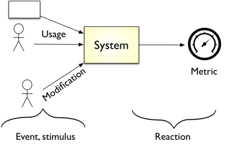

There are many ways to blog on the internet.  
You could post articles to social platforms like [LinkedIn](https://www.linkedin.com).  
You could post articles to platforms like [Medium](https://medium.com) or [Dev.to](https://dev.to).  
You could get your own website using services like [Wordpress](https://wordpress.org) that provide hosting and complete themes for blogs.  
Or you could build a website yourself.

If you decide to build a website yourself, you have more decisions to make.
What technologies to use? Where to host the website? What should it look like? ...

These decisions are significant. They are hard to change later on.
Explicit quality goals help make architecture decisions.

## Quality Attributes

To define quality goals, I work with the [ISO 25010](https://iso25000.com/index.php/en/iso-25000-standards/iso-25010) quality model.
The ISO standard defines eight quality characteristics and a number of sub-characteristics for software product quality[^1]:

- **Functional Suitability:** "the degree to which a product or system provides functions that meet stated and implied needs when used under specified conditions"
- **Performance Efficiency:** "the performance relative to the amount of resources used under stated conditions"
- **Compatibility:** "Degree to which a product, system or component can exchange information with other products, systems or components, and/or perform its required functions while sharing the same hardware or software environment."
- **Usability:** "Degree to which a product or system can be used by specified users to achieve specified goals with effectiveness, efficiency and satisfaction in a specified context of use."
- **Reliability:** "Degree to which a system, product or component performs specified functions under specified conditions for a specified period of time."
- **Security:** "Degree to which a product or system protects information and data so that persons or other products or systems have the degree of data access appropriate to their types and levels of authorization."
- **Maintainability:** "This characteristic represents the degree of effectiveness and efficiency with which a product or system can be modified to improve it, correct it or adapt it to changes in environment, and in requirements."
- **Portability:** "Degree of effectiveness and efficiency with which a system, product or component can be transferred from one hardware, software or other operational or usage environment to another."

[^1]: [ISO 25010](https://iso25000.com/index.php/en/iso-25000-standards/iso-25010)

## Quality Scenarios

Quality scenarios allow you to specify concretely what the quality attributes mean to your system or product.

As per [arc42.org](https://faq.arc42.org/questions/C-10-2/)[^2]:
> Quality scenarios document required quality attributes.
> They help to describe required or desired qualities of a system,
> in pragmatic and informal manner, 
> yet making the abstract notion of “quality” concrete and tangible.
>
> 
>
> - Event/stimulus: Any condition or event arriving at the system
> - System (or part of the system) is stimulated by the event.
> - Response: The activity undertaken after the arrival of the stimulus.
> - Metric (response measure): The response should be measurable in some fashion.

[^2]: What is a 'quality scenario'? [arc42.org](https://faq.arc42.org/questions/C-10-2/)

## Quality Goals

For this blog, I have selected the following quality attributes as quality goals.

### 1. Performance Efficiency

**Scenario 1.1 (Time Behavior):**
A user opens the page from a good device and internet connection. The page loads with a Largest Contentful Paint (LCP) of at most 1.5 seconds.

I want the blog to be simple, fast, and lean.

**Scenario 1.2 (Resource Utilization):**
The blog stays within the limits of the free plans for any used services.

A lot of service providers for hosting and operating websites have generous free plans for websites from individuals.

### 2. Reliability

**Scenario 2.1 (Maturity):**
The websit continues to work reliably with little to no operations and maintenance effort.

### 3. Portability

**Scenario 3.1 (Adaptability):**
A service provider removes teir free plan. The essentials of the website can be moved to a different provider within two person days.

## Architecture Principles

A small set of architecture principles can help make current and future architecture decisions. Architecture principles aim to be broadly applicable and give some direction for decisions.

### Built to Last

**Description:**
The content of this blog should be durable. Ideally, it should still be there in ten years.

**Motivation:**
Social networks and blogging platforms may rise and fall over time. There is no guarantee that any content that is written in platforms like LinkedIn or Medium is still there in ten years – Elon Musk could buy them at any time.

**Example:**
Store content in Git instead of using a proprietary format from some third party provider.

### Better done than prfect

**Description:**
The goal of this project is to put some content on the internet – not to build the perfect blog.

**Motivation:**
I already have a full-time job.

**Example:**
Starting this blog with placeholder-quality design.

### The more you know

**Description:**
Treat this website as a playground for learning.

**Motivation:**
A small website that virtually no one uses is an ideal playground for new technologies and other stuff I don't know.

**Example:**
Use interesting technologies.