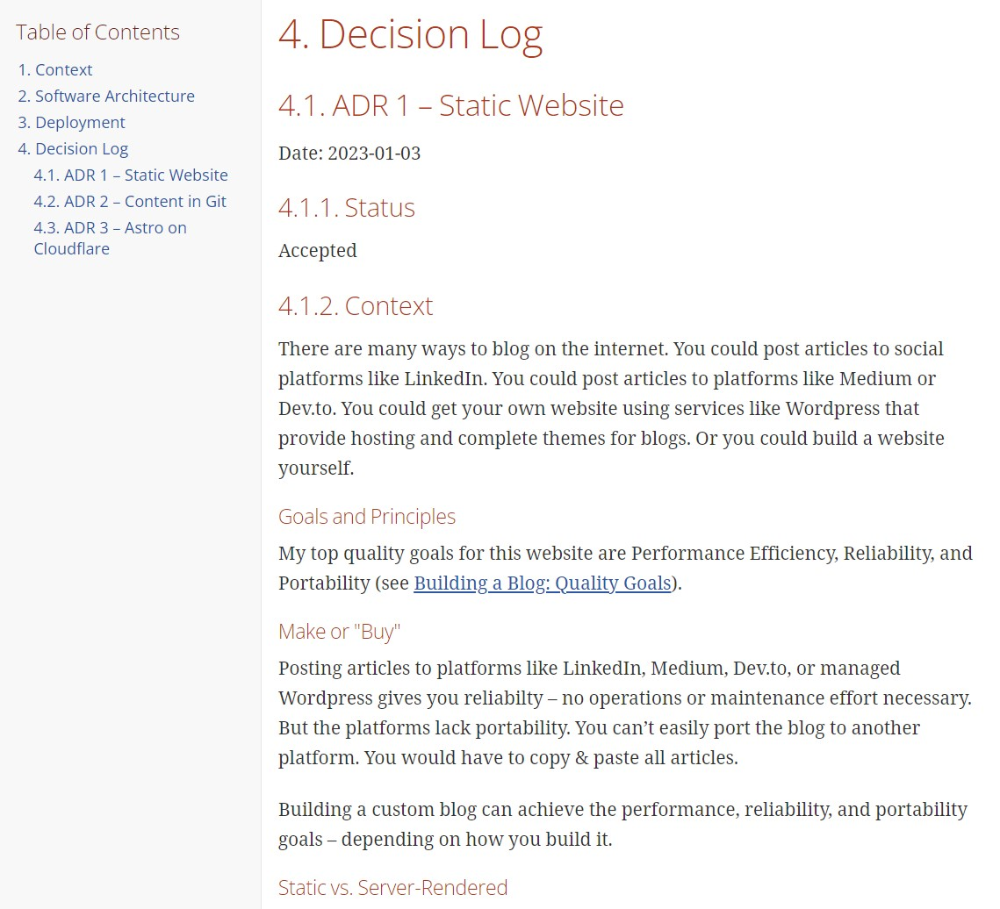

## Context

### Lightweight Architecture Documentation

> Large documents are never kept up to date.  
> Small, modular documents have at least a chance at being updated.  
> — <cite>Michael Nygard[^1]</cite>

[^1]: Michael Nygard [Documenting Architecture Decisions](https://cognitect.com/blog/2011/11/15/documenting-architecture-decisions)

Software systems typically benefit from some level of documentation.
For most systems, the sweet spot is lightweight documentation that you can create and maintain with relatively low effort.

**Architecture Decision Records (ADRs)** document significant design decisions for a system. They record the decisions with their context and motivations at the time the decision is made. They are immutable – they do not have to be updated, but they might be superseded by later decisions.[^1],[^2]

[^2]: Thoughtworks Technology Radar [Lightweight Architecture Decision Records](https://www.thoughtworks.com/radar/techniques/lightweight-architecture-decision-records)

**C4 Model Diagrams** capture the high-level architecture of a system. They contain enough detail to get an overview of the system without further explanations: they contain the descriptions of the building blocks and their relations, as well as information about the used technologies.[^3]

[^3]: [C4 Model Architecture Diagrams](/blog/2023-01-21_c4_model_diagrams/)

**arc42**[^4] and **SA4D**[^5] propose templates for pragmatic architecture documentation and can be tailored to your needs.

[^4]: Gernot Starke, Peter Hruschka [arc42](https://arc42.org/overview)
[^5]: Simon Brown [Software Architecture
for Developers](https://softwarearchitecturefordevelopers.com)

### Documentation as Code

The idea of __documentation as code__ is to maintain the documentation together with the code in version control.
The developers can work on the documentation and code in their IDE with little friction from switching tools.
The documentation can be built and deployed to the desired format and location much like the application itself. [^6]

[^6]: Gernot Starke, Ralf D. Müller [Documentation As Code](https://docs-as-co.de)

**AsciiDoc** and **Markdown** are popular markup languages for writing texts in a plain text format with special syntax for formatting, layout, links, and more. The two formats are comparable, but for documentation it helps that AsciiDoc is standardized and more exensible than Markdown. [^7],[^8]

> Markdown is a concept more than it is an implementation. It generally means
> “a set of incompatible extensions to something that looks kinda like
> Markdown”. When you are trying to author large sets of documents, it isn’t
> the correct tool.  
> — <cite>Eric Holscher[^7]</cite>

[^7]: Eric Holscher [Why You Shouldn’t Use “Markdown” for Documentation](https://ericholscher.com/blog/2016/mar/15/dont-use-markdown-for-technical-docs/)
[^8]: Seth Kenlon [Try AsciiDoc instead of Markdown](https://opensource.com/article/22/8/drop-markdown-asciidoc)

Tools like **AsciiDoctor**[^9] and **docToolChain**[^10] can convert the plain text files to formats like PDF or HTML, or publish them to a wiki.

[^9]: [Asciidoctor](https://asciidoctor.org)
[^10]: [docToolChain](http://doctoolchain.org)

**Structurizr**[^11] and **PlantUML**[^12] are two options for generating diagrams from plain-text. PlantUML is more popular and supports more types of diagrams. However, Structurizr can generate multiple diagrams from a single model of the system. [^13]

[^11]: Simon Brown [Structurizr](https://structurizr.com)
[^12]: [PlantUML](https://plantuml.com)
[^13]: [Diagrams as Code 2.0](/blog/2023-01-22_diagrams_as_code/)

### Build Process

I use **Cloudflare Pages** to build and deploy this website.
Like most platforms for static websites, the Page is connected to GitHub.
On pushing changes to the repository, Cloudflare Pages automatically builds and deployes the website. Changes to non-main branches are deployed to a preview URL. [^14]

[^14]: [Cloudflare Pages](https://pages.cloudflare.com)

With the GitHub integration, Cloudflare Pages lets you configure a short build command like `npm run build` that it executes for every build. It supports various technologies including Node.js, Python, Ruby, and Java 8. [^15]

[^15]: Cloudflare Pages [Build configuration](https://developers.cloudflare.com/pages/platform/build-configuration/)

To generate documentation with every build, you would have to include this in the short build command. Potentially, the build command could execute a shell script. The documentation of the build configuration does not mention support for executing docker containers.

As an alternative to the git integration, Cloudflare Pages offers a **Direct Upload** capability. You can build the static website using any build setup, and then upload the static files to Cloudflare Pages. This gives you full flexibility for the build pipeline and allows you to use more elaborate CI/CD processes – like including a step to generate documentation. [^16]

[^16]: Cloudflare Pages [Use Direct Upload with continuous integration](https://developers.cloudflare.com/pages/how-to/use-direct-upload-with-continuous-integration/)

**GitHub Actions**[^17] is GitHub's integrated CI/CD platform.
GitHub offer 2,000 CI/CD minutes per month for free for public repositories[^18].
Actions allows you to run docker containers within a workflow – for exampe to render diagrams.
Cloudflare Pages provide a GitHub Action for their Direct Upload feature[^19].

[^17]: GitHub [GitHub Actions](https://github.com/features/actions)
[^18]: GitHub [GitHub Pricing](https://github.com/pricing)
[^19]: [Clougflare Pages GitHub Action](https://github.com/cloudflare/pages-action)

### Goals and Principles

My top quality goals for this website are Performance Efficiency, Reliability, and Portability. One of my principles is to treat this website as a playground for learning. [^20]

[^20]: [Building a Blog: Quality Goals](/blog/2023-01-02_quality_goals/)

## Decision

I will implement documentation as code.  
I will use AsciiDoc and Structurizr for the documentation.  
I will use GitHub Actions to build and deploy the website (including documentation) to Cloudflare Pages via Direct Upload.

## Consequences

Using documentation as code, I can maintain the documentation together with the code and blog posts – versioned and using the same editor for everything.
I can make the documentation available as content of the website.

The change to documentation as code with a CI/CD process changes the deployment process significantly. This could affect portability.
On the one hand, it improves portability: the static files are built independent from Cloudflare and could be hosted anywhere on the internet.
On the other hand, competing platforms for hosting static websites may not offer a comparable direct upload capability. So the documentation may not be easy to port to another platform, but the rest of the website could be easily built using Netfliy, Vercel, and others.

Following the principle to use the blog as playground for learning, this decision will allow me to gain some experience with AsciiDoc and GitHub Actions.

## Result

I deploy the documentation as HTML (generated from AsciiDoctor) with the website to [Documentation](https://www.philip-schmitt.de/docs/documentation.html).

Commits:

- [Add architecture diagrams using Structurizr DSL](https://github.com/philipschm1tt/website/commit/aa2be0de5ba880be3c653549b487ca82f03105b6)
- [Add initial ADRs and basic structure for documentation](https://github.com/philipschm1tt/website/commit/48c1cc8e05873632eba952c5fc6c48dab5b4e0fd)
- [Deploy to Cloudflare Pages via direct upload using GitHub Actions](https://github.com/philipschm1tt/website/commit/72f5d20dcaa2b5efa5fa70187dc81510567d7f81)
- [Build architecture documentation](https://github.com/philipschm1tt/website/commit/d0c96b9c9fb0461586aea1b59a79990d269172dc)
