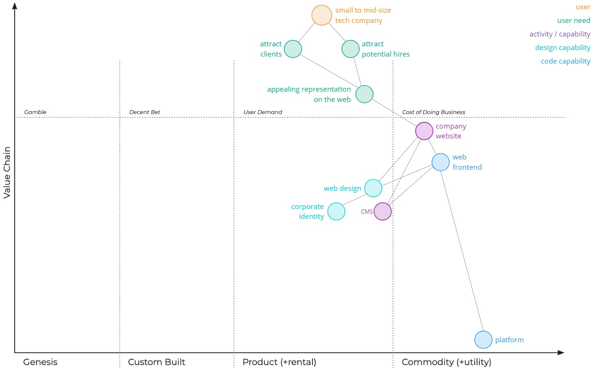
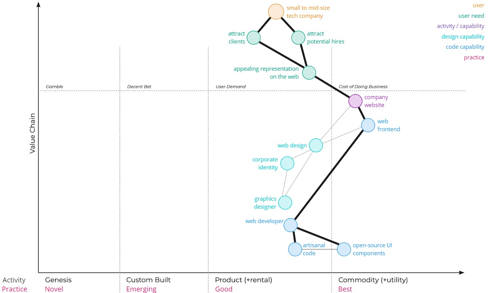

Wardley Mapping[^thebook] is a valuable tool for business strategy and tech strategy.
In this article, I want to introduce Wardley Mapping in the context of a simple build vs. buy decision. I will jump right in without much theory / introduction.

[^thebook]: Simon Wardley [Wardley maps](https://medium.com/wardleymaps)

Disclaimer: I'm not an expert on Wardley Mapping – I'm still learning it, myself.
For more in-depth introductions, I recommend the book by Simon Wardley[^thebook] and learnwardleymapping.com by Ben Mosior[^learnwardleymapping]. I will use Ben's template to visualize the map.

[^learnwardleymapping]: Ben Mosior [learnwardleymapping.com](https://learnwardleymapping.com)

## A Company Needs a Website

We will explore the scenario, where a company has a generic company website and has to make a build or buy decision.

The company is a small to mid-size tech company.
They have the budget to outsource their website, but they also have the expertise to build it themselves. They want a custom website with full design freedom; they don't want to use a website builder or start with a generic Wordpress template.

The company has some "jobs to be done": it needs to attract clients and potential hires.
One small piece of the puzzle, that these two needs depend on, is an appealing representation on the web.
And that representation on the web depends – in part – on the company website.

In a Wardley Map, that can be represented like this:

The "user" anchors the map at the top followed by their needs. To address the user needs, the company needs some capabilities or perform some activities. In this case, the representation on the web depends on a company website.

I placed the user needs in the third column as "user demands".
These user needs are important to the company: they don't just want to do what everyone else is doing but adapt the website to their context to accomplish the jobs to be done as well as possible.

I placed the company website in the fourth evolution stage: "Commodity".
Company websites are "widespread" and "well-defined". The perception in the industry is that you need a "standard" website as a "cost of doing business".[^landscape]

[^landscape]: learnwardleymapping.com [Landscape](https://learnwardleymapping.com/landscape/)

Note: I use Simon's large table of evolution characteristics[^landscape] to decide in which column to place components. There is often some ambiguity where different people might place the components at different locations – leading to interesting conversations.

## A Company Website?

Going further down the value chain: what does a company website depend on?

Broadly speaking, a company website needs a web frontend, web design, and a Content Management System (CMS). The web frontend depends on the design and the CMS.

I placed the web frontend in the Commodity stage. For a standard company website, the technology does not matter much. You could commission a website without concerning yourself with the technical choices for the web frontend.

I placed the web design at the right side of the "Product" column. Company websites are generally similar in terms of structure and features, but there are some significant differences betweens the website designs of different companies in the industry.

I placed the CMS at the right side of the "Product" column, too, for roughly the same reason: current CMS-as-a-service solutions are generally similar, but there are some significant feature differences between current CMS services (like Contentful, Storyblok, Sanity, Strapi, ...).

The web frontends depends on a platform. You could, for example, host a simple website on one of the Cloud providers or on platforms like Netlify, Vercel, and Cloudflare Pages. In the context of hosting simple static websites, you can use the platforms almost interchangeably.

The web design depends on the corporate identity of the company.
I placed it slightly further to the left. That area of design goes beyond websites and may need more specialized design expertise.

## Let's Outsource It

It is a widespread practice to outsource the design and implementation of company websites to agencies or freelancers. These "Commodity" websites are generally not core to what the company does and needs to focus on. Companies may lack the design or technical expertise to build the website themselves. In addition, the agencies and freelancers gain efficiency from working on many similar projects for different clients.

I placed the agencies in the "Product" column. Agencies and freelancers for company websites may almost be a commodity but I expect significant differences between different agencies/freelancers.

Outsourcing the initial creation and continued maintenance of a company website can lead to some challenges.
You need some project management to interface with and align with the agency. One potential challenge is that the alignment with the agency may bring some communication overhead – binding resources within the company. Another challenge is a potentially long lead time for changes – especially after the initial construction of the page. You need to specify the desired change, request a quote from the agency, sign off on the quote, and then wait for the implementation that may be slotted in after some planned or in-progress work of the agency. The time required to interface and align with the agency adds to the cost of change. In the maintenance phase of the website, the company may not experience much of the efficiency of the agency – mainly the wait times and the overhead.

These components are not be a perfect fit for the typical "activities" or "capabilities" you would expect on a Wardley Map, but Wardley Mapping is flexible in that way. I placed these inefficiencies of outsourcing work to agencies at the center of the "Product" column. They are aspects of the agency components, that keep the agency from becoming a commodity: the agency is not an "almost invisible component" or  – there may be quite a bit of waste. It's work in a "domain of professionals".[^landscape]

## Developing the Web Frontend

In this scenario, the company is not satisfied with the long lead time for changes and the required communications overhead they are experiencing with the agency. The company has some internal web development capabilities.
The question comes up: wouldn't it be easier to "just" take over the maintenance and continued development of the website?

So let's have a closer look at the web development part of the company website:

To maintain the web frontend, you need some web developers.
They may use an open-source UI component library to not have to re-invent the wheel for all components.
The library might work as a "Commodity": something "standard" and "mature" that you can just use.
They would still need to write some code themselves to achieve the desired design. I placed that in "Product": there are various competing models for developing websites.

What about AI, though?

The ongoing AI revolution already has an impact on building simple, static websites like your typical company website.
LLMs can now help developers write code – they should be very valuable for building a basic company website.
Assumption: the use of AI can make the development of simple websites significantly more efficient.
In addition, the first AI website builders are emerging that can take UI designs as input and output code[^builderio].
In the near term, such AI support can make the work of developers significantly more efficient.
In the not-so-distant future, these tools may be able to fully automate the development of simple, generic websites.

[^builderio]: Builder.io [AI-Powered Figma to Code (React, Vue, Tailwind, & more)](https://www.figma.com/community/plugin/747985167520967365/builder-io-ai-powered-figma-to-code-react-vue-tailwind-more)

I placed AI code generation near the left side of the "Product" column.
While these "copilots" are still pretty new, they are evolving quickly.
Their adoption is rapidly increasing. The market is growing with various providers offering products.
From the developer perspective, the use of AI assistants during development is increasingly common.
AI code generation "competes" directly with writing code by hand and using open-source UI components and using open-source UI components. If you generate code, which may or may not make use of existing open-source components, you will need to write less code yourself.

I placed AI website builders in the "Custom" column. These technologies are just emerging – they are "leading edge".
When these AI website builders evolve into the "Product" column or the "Commodity" column, you may no longer need a web developer to build a typical company website.

## Everything Evolves Through Supply and Demand Competition

Evolution is a key concept in Wardley Mapping.
Over time, components move to the right – if there is demand.[^climate]

[^climate]: learnwardleymapping.com [Climate](https://learnwardleymapping.com/climate/)

AI code generation originally started in the "Genesis" column – with research and experimentation; "exploring the unknown". There was no market for it.

AI code generation made the leap to the "Custom" column.
We saw "rapid increases in learning". A market started to form.
The industry went "looking for ROI and case examples".

AI code generation is now making the jump to the "Product" column.
The "ubiquity" is "rapidly increasing". The market is growing with a growing number of commercial providers for "copilots".
Companies are evaluating different models to learn if "this model is better than that".
Developers have experienced this new capability and are disappointed if it's not available.

Through continued competition, AI code generation can eventually make the jump to become a commodity: "an accepted, almost invisible component" – "well defined" and "stable".

As components evolve, their characteristics change:[^climate]

| Uncharted | Industrialized |
| --------- | -------------- |
| Chaotic   | Ordered        |
| Uncertain | Known          |
| Unpredictable | Measured   |
| Changing  | Stable         |
| Different | Standard       |
| Exciting  | Obvious        |
| Future Worth | Low Margin  |
| Unusual   | Essential      |
| Rare      | Ubiquitous     |
| Poorly Understood | Defined |
| Experimentation | Volume Operations |
| Differential | Operational Efficiency |
| Competitive Advantage | Cost of Doing Business |

It feels like the AI code generation capability is _speedrunning_ through the stages of evolution.
How long until it will be "standard" – a "cost of doing business"?

## Build vs. Buy vs. Generate

Practices can co-evolve with capabilities[^climate].
Today, it may be a "best practice" to outsource the web frontend of a company website.
It may still be a "good practice" to build the web frontend yourself if you have a good reason to do it differently than most of the industry.
But as the practice of generating the web frontend with AI evolves, that may become the new best practice.
If we have a reliable, standard, ubiquitous way to build a simple company website just with AI, why would you do it any other way?

The company now has a good overview of the changing landscape of building simple websites. The question remains: should the company take over the maintenance of the web frontend from the agency?

There is no one right, clear answer.

If the company takes on the maintenance of the web frontend, they would still need the agency for the design. So for any design changes, you would still need to deal with the alignment, lead times, and costs of working with the agency.

You could argue that the internal development with AI support might be smoother and that many changes that don't require new design could be done quicker and easier.
The internal alignment on changes might be quicker.
The changes might require less lead time (depending on internal development capacity).

You might still use some internal development capacity on something that is less important than what the developers should be working on.

Unless...
The maintenance of a simple website could also be an opportunity to become an early adopter of AI website generators. A simple website like your typical company website might be ideal for experimenting with these new capabilities.
If the company also has a goal to keep up with AI trends, then it might make sense for them to take over the maintenance of the website.

## What Does That Mean for Agencies and Freelancers?

We've looked at Wardley Mapping for a build vs. buy decision of a tech company.
That can be a valuable exercise to shape the tech strategy to the company.
But Wardley Mapping can be even more important for business strategy.

If web development for simple or generic websites is becoming a "Commodity",
what does that mean agencies and freelancers that are focused on simple websites?
The rise of AI code generation presents both opportunities and threats.

AI code generation for simple websites will empower more people to build websites.
For example, freelance designers will be able to build custom websites with little programming expertise.
In addition, agencies can build more simple websites with fewer developers.
The "development" part of building websites will be quicker and cheaper.
That can lead to a race to the bottom where agencies and freelancers compete on price.

As components evolve through the four stages of evolution, companies have to deal with inertia[^climate].
When capabilities like AI code generation become more widespread, agencies and freelancers will adapt. This can present a challenge for agencies that have been successful before AI:
there may be resistance to change.

If an agency does not want to join the race to the bottom, they have to adapt.
One option is to move upmarket:
instead of focusing on "Commodity" capabilities like generic websites,
they could focus on complex capabilities that are critical to their clients.
That could include projects with more complicated web frontends that require expertise in topics like design systems, accessibility, and mobile apps.
With a full-service approach that includes both code and design focused on high-end projects, an agency could conceivably thrive even when AI generators capture the market for simple websites.

## Landscape + Climate + ? = Profit

Wardley Mapping is a valuable tool for business strategy and tech strategy.

You create a map to visualize the competitive landscape in the industry.[^landscape]
Then you consider the external forces on that map with the help of the list of climatic patterns.[^climate]
This may give you some hints on where things are moving and help you anticipate changes.
Thus, Wardley Mapping can help inform your strategy and tech strategy.

What do you need to capitalize on these insights and where do you go from here?

First your organization needs to operate at a level where you can implement a strategy effectively.
Simon Wardley has collected a set of "Doctrinal Principles" that organizations should strive for.
For example, "Know your users (e.g. customers, shareholders, regulators, staff)":
if you don't know your users, you may have a hard time coming up with the right strategy or executing on it.[^doctrine]

[^doctrine]: learnwardleymapping.com [Doctrine](https://learnwardleymapping.com/doctrine/)

If you have a Purpose, know the Landscape and the Climate, and satisfy the Doctrine, you have the right foundation to devise and implement a strategy.
Simon Wardley has generously also collected a set of strategic plays for you to consider.
For example, "open approaches" can accelerate the process of evolution: "the act of making something open reduces barriers to adoption, encourages collaboration, and accelerates the evolution of the component."[^leadership]

[^leadership]: learnwardleymapping.com [Leadership](https://learnwardleymapping.com/leadership/)

There is not one correct map.
Different people or groups would arrive at different results.
The map helps externalize ideas and opinions on the competitive environment and how it changes.
It can help trigger valuable discussions and create alignment.

> In my opinion, the most useful aspect is not the map but the process itself, especially if done with other people.
> It's a great tool to trigger interaction and prompting questions.  
> — <cite>Oliver Finker[^ofinker]</cite>

[^ofinker]: Oliver Finker [Tweet](https://twitter.com/ofinker/status/1744450485178806371)

You don't need Wardley Mapping to anticipate trends in AI and most organizations don't use Wardley Mapping to work on strategy. But it helps! Give it a try.
