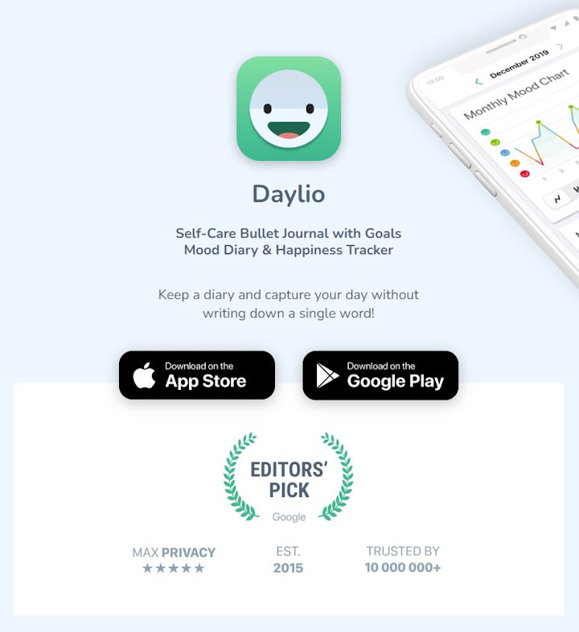
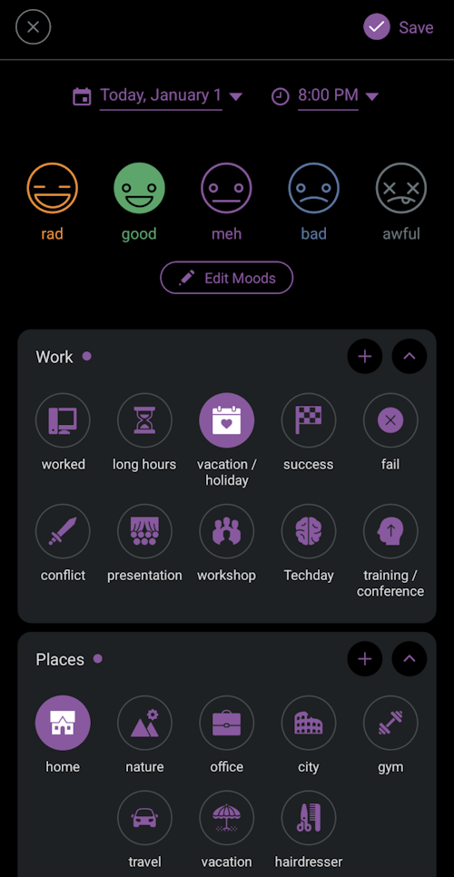
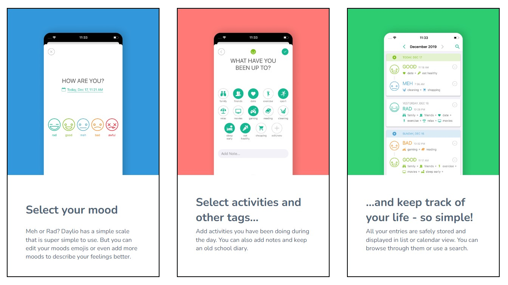
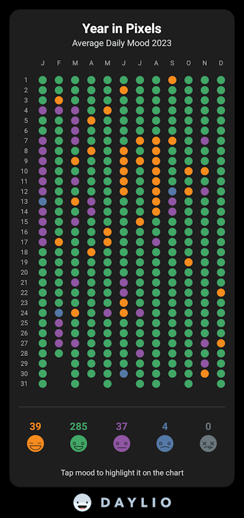
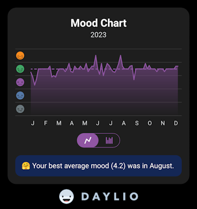
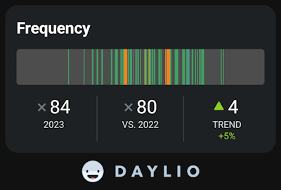
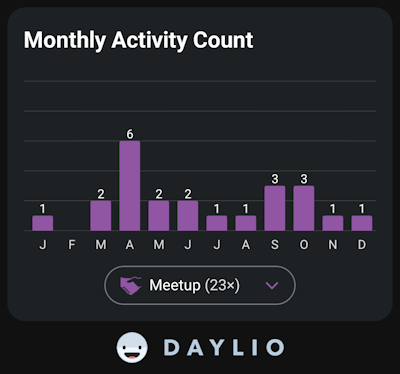
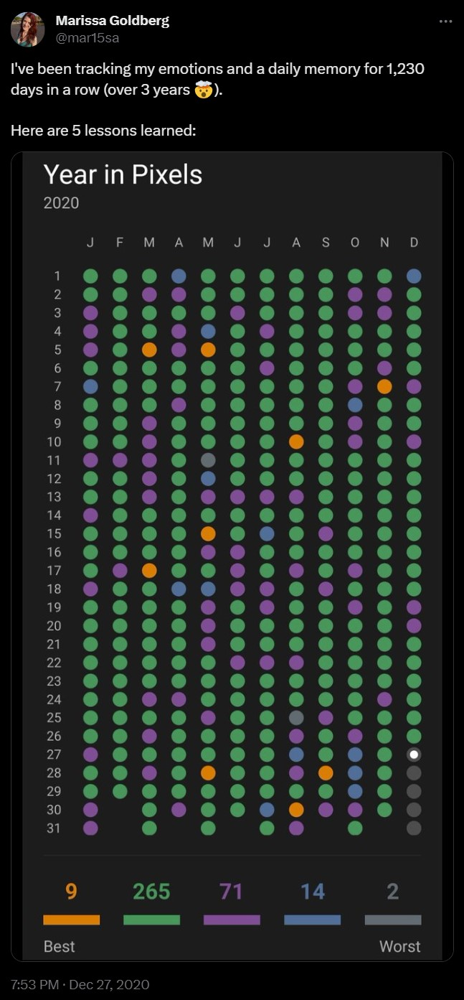
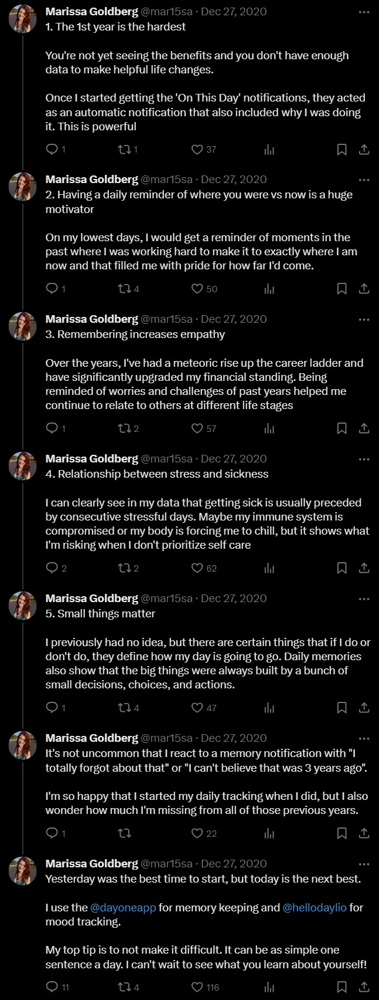

I've been using the app Daylio (12 Euros per year) as a low-effort life tracker / diary for 1100 consecutive days. That's worth a recommendation.

Every day at 8pm I get a notification on my phone to add today's entry to Daylio.
I rate my day: rad, good, meh, bad, or awful.
And I check off some activities that I did that day.
Sometimes I add a few words of text or some photos from my phone's gallery to add details to a day.

Daylio.net depicts this process like this:

## 2023 by the Numbers

In 2023 I added 365 entries with a total of 2132 activities.  
My year in pixels:

I'm deliberately generous what counts as a good day.
I'd rate most of my days last year (and in general) at least "slightly good" and then I _round up_ :)
If a day was "fine" with generally engaging work and some free time, it gets a "good".
Example: when I got Covid in August during my vacation (with very mild symptoms), my "rad" streak stopped and I marked on day "meh", but I still rated my Covid days "good" since my symptoms were mild enough that I could still use my vacation days with enjoyable indoor activities (TV). They were not really bad days.

My top activities:

1. Being at home (364x)
2. Watching TV or a movie (334x)
3. Good sleep (323x)
4. Doing something outside (109x)
5. Working long hours – around 9.5h and above (87x)
6. Cycling (84x)
7. Gaming (83x)
8. Learning (74x)
9. Procrastinating (61x)

Daylio lets you further drill down into the data.

For example, I went cycling 84 times (usually for 1–2 hours).
Up slightly form the year before.

I've been getting a lot less exercise since I stopped going to the gym (because of Covid). I'm not motivated enough to work out at home.
Working out in a room with 10+ people with limited ventilation still feels like a bad idea.

I attended 23 meetups – some remote, some in-person.

## My Inspiration

I started using Daylio at the start of 2021 after seeing it on twitter.
Marissa Goldberg tweeted her 2020 and her experiences with the app:[^inspiration]

[^inspiration]: Marissa Goldberg [Tweet](https://twitter.com/mar15sa/status/1343268779111886853)

## My "Activities" for 2024

You can freely customize the categories and "activities" and their icons in Daylio.
For 2024 I slightly adjusted / updated the "activities" I can check off each day.
I removed some that I never used, and added some that I _might_ want to use.

A tweet[^example] I saw today inspired my to including tracking when my allergies act up and on how many days I poop. I don't know if I'll keep that around – if I want to ask myself the question, whether I pooped today, every night. But it's easy to include and remove again and I don't have good data on it. :)

[^example]: Aella [Tweet](https://twitter.com/Aella_Girl/status/1741551160207499751)

The list is now pretty long, but since the "activities" work like simple checkboxes, it still only takes me a minute to create an entry.

- work
  - worked
  - long hours
  - vacation / holiday
  - success
  - fail
  - conflict
  - presentation
  - workshop
  - Techday
  - training / conference
- places
  - home
  - nature
  - office
  - city
  - gym
  - travel
  - vacation
- social
  - family
  - friend
  - colleague
  - meetup
  - team event
  - multiplayer
- hobbies
  - movies & tv
  - reading
  - gaming
  - keyboard
  - cinema
- better me
  - learn
  - project
  - content created
  - procrastinated
- fitness
  - cycling
  - exercise
  - pushups
  - swimming
  - walk
  - yoga
- emotions
  - stressed
  - anxious
  - worried/sad (family)
  - worried/sad (pet)
  - unsure
  - angry
  - cried
  - excited
  - grateful
  - relaxed
  - tired
  - bored
- health
  - poop
  - shower
  - allergies
  - illness
  - blockade
  - dentist
  - doctors visit
- sleep
  - good sleep
  - medium sleep
  - bad sleep
  - sleep early
  - sleep late
