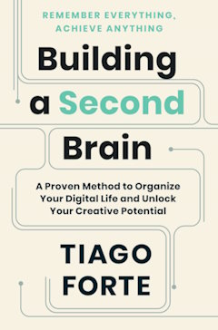
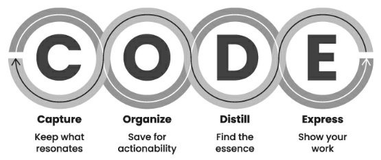
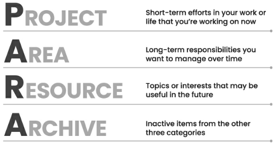
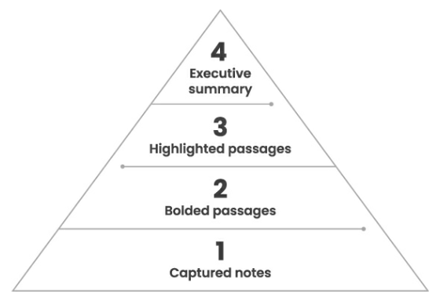

The essence of the book Building a Second Brain by Tiago Forte:
"progressive summarization" using excerpts from the book.[^2ndbrain]

[^2ndbrain]: Tiago Forte [Building a Second Brain](https://www.goodreads.com/book/show/59616977-building-a-second-brain)

## Summary

- Proposes an approach to Personal Knowledge Management using a digital notebook as an extension of your brain
- When you come across something that resonates with you, capture it in a digital notebook
- Organize your notebook by projects and areas of interest so that the information becomes a) actionable for a current project or b) findable for a future project
- Distill the information to its essence to make it easy to browse and digest in the future
- Engage with the information to make it stick
- You shouldn't do everything at once; you can make capturing information quick and painless and eventually organize and distill information in a regular session

---

## CODE

### <mark>Capture</mark>: Keep What Resonates

The solution is to **keep only what resonates** in a trusted place that you control, and to leave the rest aside.

Capture criteria:

- Does It Inspire Me?
- Is It Useful?
- Is It Personal?
- Is It Surprising?

### <mark>Organize</mark>: Save for Actionability

- **Projects**: What I’m Working on Right Now
- **Areas**: What I’m Committed to Over Time
- **Resources**: Things I Want to Reference in the Future
- **Archives**: Things I’ve Completed or Put on Hold

Here’s the problem: **the moment you first capture an idea is the worst time to try to decide what it relates to.**

This order gives us a convenient checklist for deciding where to put a note, starting at the top of the list and moving down:

1. In which project will this be most useful?
2. If none: In which area will this be most useful?
3. If none: Which resource does this belong to?
4. If none: Place in archives.

**Any piece of information (whether a text document, an image, a note, or an entire folder) can and should flow between categories.**

### <mark>Distill</mark>: Find the Essence

Every idea has an “essence”: the heart and soul of what it is trying to communicate.

Every time you take a note, ask yourself, <mark>**“How can I make this as useful as possible for my future self?”**</mark>

<mark>**Progressive Summarization:**</mark>

The effort we put into Progressive Summarization is meant for one purpose: to make it easy to find and work with our notes in the future.

### <mark>Express</mark>: Show Your Work

**To truly make an idea stick, you have to engage with it.** You have to get your hands dirty and apply that knowledge to a practical problem. We learn by making concrete things—before we feel ready, before we have it completely figured out, and before we know where it's going.

All these actions—**evaluate, share, teach, record, post, and lobby\***—are synonyms for the act of expression. They all draw on outside sources for raw material, they all involve a practical process of refinement over time, and they all end up making an impact on someone or something that matters to you.
