I spend a lot of time in front of computers.
There are few devices that I use more than a keyboard.
So it is _basically reasonable_ to spend 500+ Euros on a keyboard _(is what I tell myself)._

I like quality and design. I prefer to buy things that last.
When it comes to keyboards, that leads to mechanical keyboards.
They aim to provide the best typing experience with the best feel and sound.
They tend to last; they can be cleaned and repaired.

Ideally, you buy a sub-200 Euro pre-built keyboard and stop there.
If you are satisfied with your keyboard that's a good place to stop!

Unfortunately, pre-built mechanical keyboards have not always been great.
They have mostly used stock Cherry MX switches that don't sound or feel all that good.
Together with bad stabilizers in larger keys like the space bar that make unwanted rattling noises.

<audio controls src="/media/2024-01-07_sound_ozone.mp3"></audio>

It turns out there is a big keyboard scene that offers endless customization options to chase after a keyboard that exactly matches your preferences.

How do you want the keyboard to...  
... look?  
... feel?  
... sound?

<audio controls src="/media/2024-01-07_sound_fbtkl.mp3"></audio>

## The Keyboard Rabbit Hole

### Your Preferred Layout

Keyboards come in many **different sizes and layouts**.
The following images shows a subset of the Keychron Q series[^keychron] that covers various "popular" layouts from 40% to the traditional full-size layout:

[^keychron]: Keychron [Q series keyboards](https://www.keychron.com/collections/keychron-q-series-keyboard)

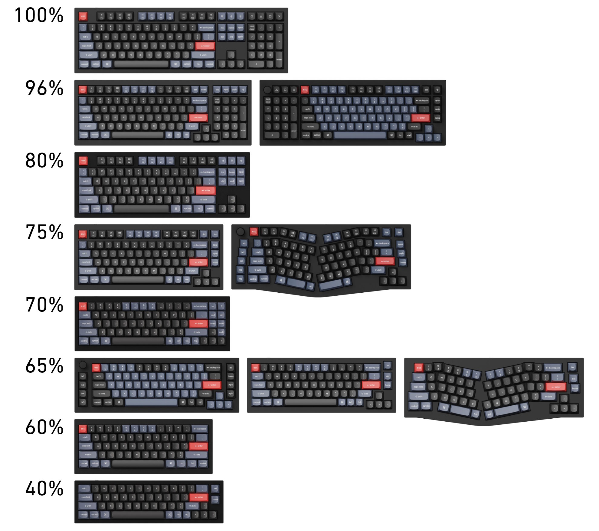

This list of layouts is by no means exhaustive.
Notably, it does not include split keyboards, ortholinear layouts, and most other ergonomic layouts.
In addition, there are numerous variations of each layout.

### Your Preferred Kit

The core component of a custom keyboard is the "keyboard kit".
You can buy a barebone kit that contains the case and the electronics of a keyboard but without the keycaps (the plastic pieces with the legends on them) and the mechanical switches. Barebone kits come in countless variations with **different designs and colors**.

The case is typically made from either **plastic or aluminum**.
It may incorporate other metals like brass to affect the sound and weight of the keyboard.

The keyboard kit decides the **layout** and **typing angle**.
It also determines how the switches are mounted on the board (soft, hard, bouncy).
Thus, the kit affects the ergonomics, sound, and feel of typing.

A recent example of a popular keyboard kit from the Chinese Qwertykeys is the Neo65 with an 65% layout. You can choose between 9 colors for the case and 5 colors for the weight on the bottom of the keyboard.[^neo65]

[^neo65]: Qwertykeys [Neo65](https://qwertykeys.notion.site/Neo-65-6c8ae7895ec442dea809057c3dc5e113)

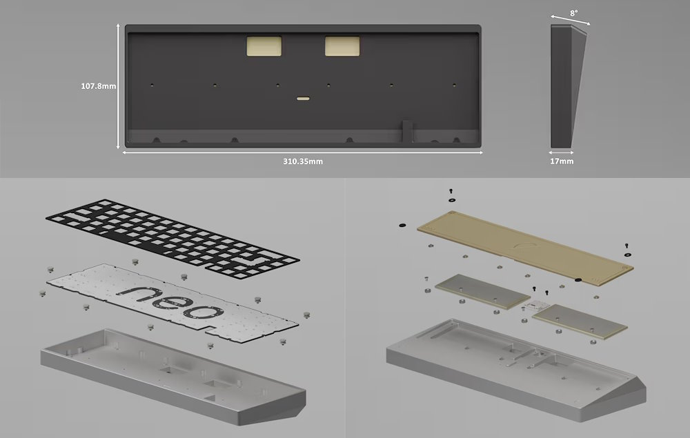

Besides the look of the keyboard, the keyboard kit also offers ways to customize the sound and feel of the keyboard.
There are typically multiple options for the "plates" that keep the switches in place on top of the PCB. Plastic plates (like POM) are more flexible and lead to lower-pitched sounds; metal plates (like aluminum) are stiffer and lead to higher-pitched sounds.
In addition, kits often offer multiple options for mounting the assembly of PCB, plate, and switches in the case to modify the stiffness/flexibility.

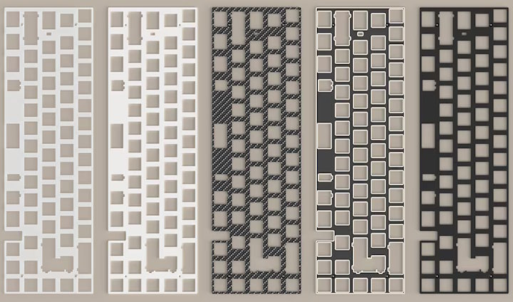

Some keyboard kits are made by hobbyists that design the keyboard in their free time and then start a group buy. If they can find 10–200 people who join in, it gets manufactured. That's truly "custom" with just a few people in the world having that board.
Other keyboard kits are made "professionally" by companies and get sold thousands of times.

### Your Preferred Keycaps

Obviously, the keycaps play a big role in the look of the keyboard:
they come in many colors.
They also come in different shapes and materials.

The following image shows the colorful, 80s inspired GMK Retrowave[^retrowave] as an example for a premium keycap set with vibrant colors and "novelty" keycaps matching the theme:

[^retrowave]: SwitchKeys [[GB] GMK RETROWAVE](https://geekhack.org/index.php?topic=114355.0)

[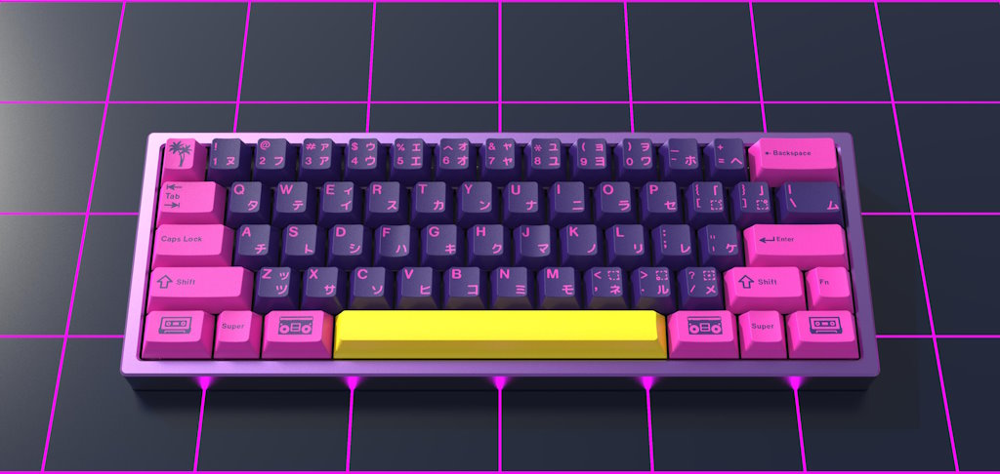](https://geekhack.org/index.php?topic=113905.0)

The  next image shows the Cthulhu-themed GMK Terror Below[^terrorbelow]:

[^terrorbelow]: Afresh [[GB] GMK Terror Below](https://geekhack.org/index.php?topic=113905.0)

[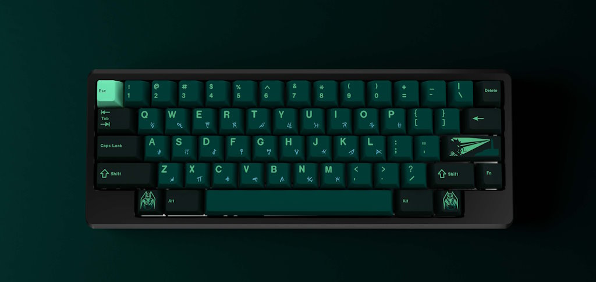](https://geekhack.org/index.php?topic=114355.0)

The following image from [keycaps.info](https://www.keycaps.info) shows a selection of **keycap profiles**. The keycap profile affects the ergonomics and the sound of the keyboard:[^profiles]

[^profiles]: keycaps.info [keycaps.info](https://www.keycaps.info)

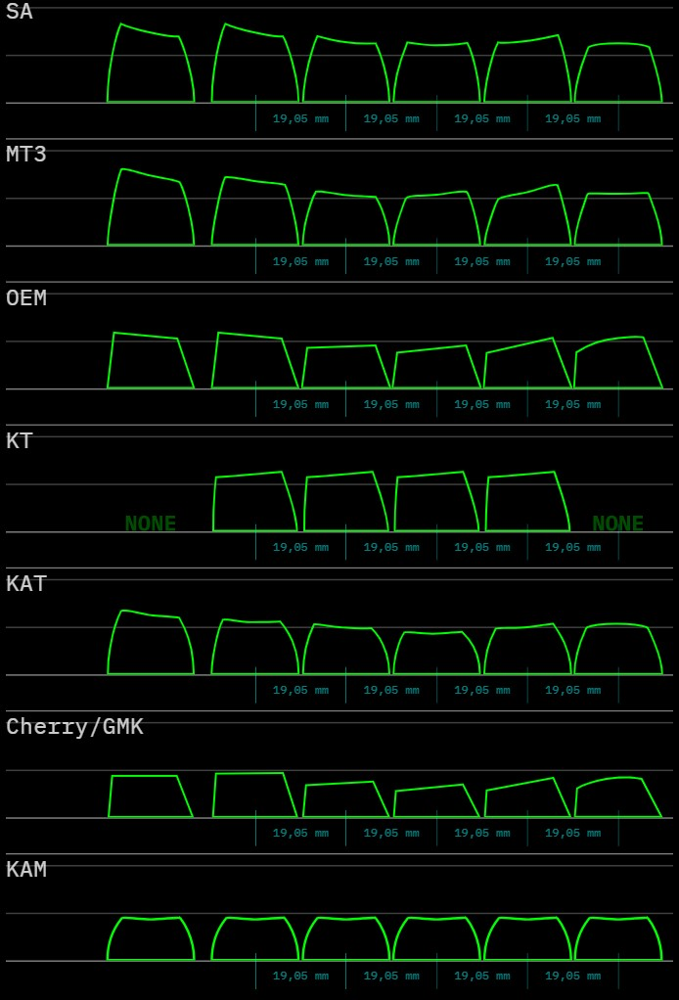

Keycaps come in different **materials** with varying thickness.
Commonly they use either ABS or PBT plastic; or some blend of the two.
The material and mass of the keycaps affects the sound of the keyboard.
There are also differences in the texture of the keycaps.

There are different ways to get the **legends** onto the keycaps.
With double shot injection molding each keycap is made from two pieces of plastic of different colors. That technique enables vibrant colors with the most freedom of color choice. Alternative approaches include different types of printing or laser etching.

For more information on keycaps see [Keycaps 101](https://www.keyboard.university/100-courses/keycaps-101-ydy8j).[^keycaps]

[^keycaps]: Keyboard University [Keycaps 101](https://www.keyboard.university/100-courses/keycaps-101-ydy8j)

### Your Preferred Switches

Most mechanical keyboards use **Cherry MX** style switches.
Inside the top and bottom housings, there is a "stem" on top of a spring.
When the stem is pressed down, a piece of metal touches a contact point, which actuates the key press. The following image from Cherry shows the internals of a Cherry MX Black switch.[^cherrymx]

[^cherrymx]: Cherry [Cherry MX](https://www.cherrymx.de/cherry-mx/mx-original/mx-black.html)

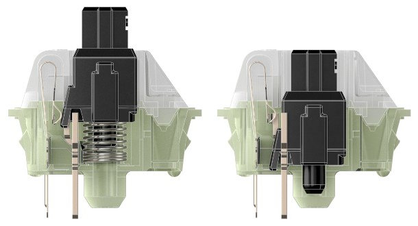

Today, there are many manufacturers producing Cherry MX compatible switches.
The switches use different **materials** for stems and housing as well as different **springs**. In addition, the switches often come **lubed** to avoid undesirable sounds from the springs and from the stem moving inside the housing.

The choice of switches affects the **sound** of the keyboard.
Different switches produce sound at different volumes and pitch.

The choice of switches also affects the **feel** of the keyboard.
**Tactile** switches give you "tactile" feedback when pressing down on the key.
Ideally, you can feel the point of actuation.
**Clicky** switches even include an audible click at the point of actuation to give the typist as much feedback as possible.
**Linear** switches provide a smooth force curve all the way down, where you can't tell at which point the switch actuates.
Depending on the spring, switches need different amounts of force to press down.
Pressing down on the switches can feel smooth or scratchy.

The following image shows the force curves of Cherry MX Black, Brown, and Blue switches.
MX Blacks actuate after 2mm of travel. The force curve is linear between ~40g at the beginning of the key press and ~80g at the bottom with ~60g required at the actuation point.
MX Browns offer a bit of tactility. You feel a small bump shortly before the actuation point.
MX Blues add an audible click.
[^cherrymx]

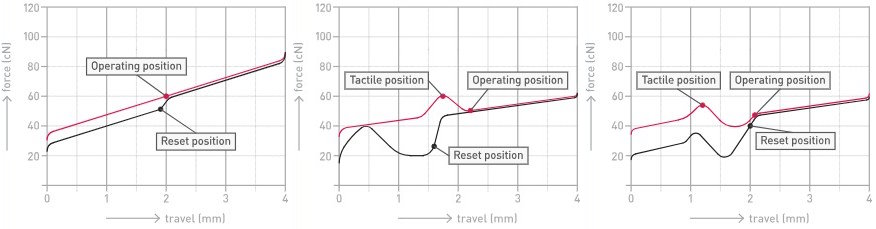

Note: the typical keyboard enthusiasts would not use stock Cherry MX switches!
They are scratchy, produce undesirable sounds like spring ping, and they can feel inconsistent. Instead, keyboard enthusiasts either use non-Cherry switches or invest considerable effort to tune the switches by replacing the springs and manually lubing them.

There are hundreds – if not thousands – of kinds of switches providing different characteristics. For some (excessively detailed) written reviews, see [theremingoat.com](https://www.theremingoat.com).[^theremingoat]

[^theremingoat]: ThereminGoat [ThereminGoat's Switches](https://www.theremingoat.com)

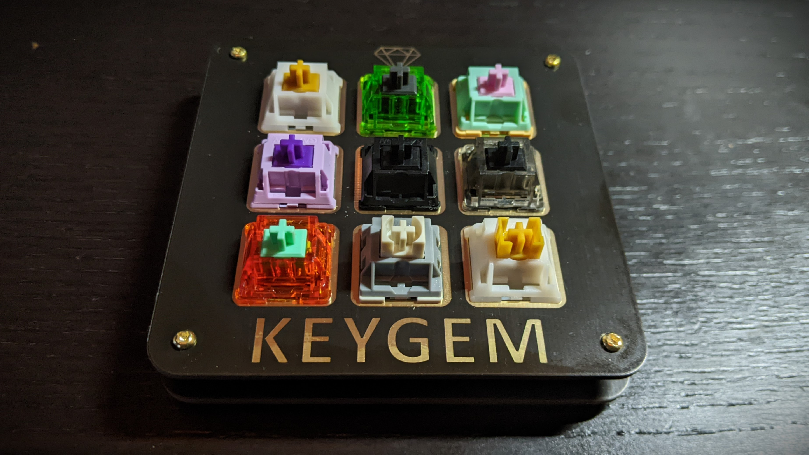

For more information on switches see [Switches 101](https://www.keyboard.university/100-courses/switches-101-xnyng).[^switches]

[^switches]: Keyboard University [Switches 101](https://www.keyboard.university/100-courses/switches-101-xnyng)

### Tuned to Your Preferences

Once you have all components for a keyboard, there is still ample room to tune it to your preferences.

Many types of switches are not great out of the box.
Armed with a switch opener, a brush, some tweezers, and the right lube, you can open up each individual switch and **apply lube to the spring and stem**. This aims to reduce unwanted sounds like spring ping and make the switch smoother. Of course, there are different kinds of lube and different lubing techniques that can also lead to different results.[^alexotoslubeswitches]

[^alexotoslubeswitches]: alexotos [How To Lube Your Switches w/ Tips and Tricks - 2022](https://www.youtube.com/watch?v=88tnUYbxaIs&t=424s&pp=ygUNYWxleG90b3MgbHViZQ%3D%3D)

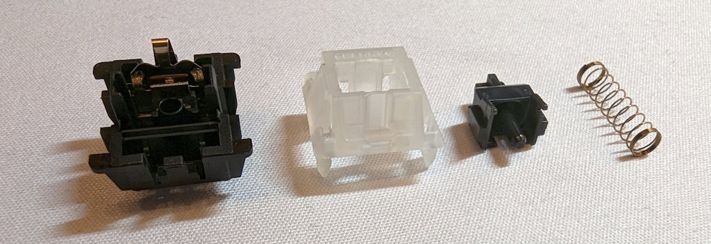

Keyboard enthusiasts go to especially great lengths to tune Cherry MX switches.
To tune the popular Cherry MX Black switches, you would use swap the springs to higher quality, more consistent springs that match your preferences for the required force and the force curves.
To reduce wobble between the top and bottom housings, you would add special **switch films** between the housings.
To further reduce the scratchiness of the switches, you might use a **break-in-machine** to trigger each switch a couple hundred thousand times.
Going to extreme lengths, you might invest considerable effort to **"polish"** the switches to make them as smooth as possible.

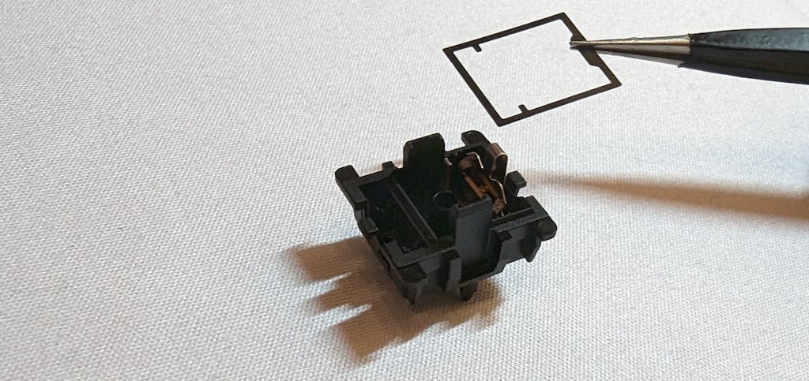

You may need to pay special attention to the **stabilizers** under the long keys.
Especially to avoid undesired sounds on the space bar.[^alexotoslubestabilizers]

[^alexotoslubestabilizers]: alexotos [How To Lube and Properly Tune Stabilizers - 2022](https://www.youtube.com/watch?v=vxHb6CJc9V8&pp=ygUNYWxleG90b3MgbHViZQ%3D%3D)

You can experiment with different **plate materials**.
Keyboard kits typically offer the choice of multiple plate materials with the option of buying more than one plate to experiment with.
Typical plate materials are PC, POM, FR4, brass, aluminum, steel, copper, and carbon fiber.[^keyboredplates]

[^keyboredplates]: keybored [What Do Different Plates Sound Like?](https://www.youtube.com/watch?v=GmljIhkHOlI)

Keyboard kits often include different kinds of **foam** that you can apply optionally.
You may apply case foam to reduce the empty space below the PCB and reduce hollowness in the sound.
A thin layer of PE foam between the PCB and the switches changes the sound profile dramatically: it filters out higher frequencies.

### Add to Cart

Buying keyboards is often not as simple as going to a website and clicking "add to cart". Many keyboard kits, keycap set, and other components are not "in-stock" products. They are often sold in **"group buys"**: there is a limited time window when you can order a product and the manufacturing process only starts after that window.

You can buy group buy a product during that specific window and then wait for it, or hope that vendors order some "extras" of the item and then sell these in-stock once the item is manufactured, or you wait to buy the item aftermarket – when a keyboard enthusiast that has too many keyboards decides to sell some of them (barely) used.

It can take a long time until you can hold group buy products in your hands.
For example, when the keyboard hobby spiked in popularity during the pandemic, there were more keycap group buys than manufacturing capacity. Some keycap sets took more than two years to produce.

### Conclusion

In conclusion, **don't do it.**

Don't follow keyboard content creators like the keyboard photographer MarcherChun on [Youtube](https://www.youtube.com/@MarkerChun/videos) or [Instagram](https://www.instagram.com/markerchun/).[^markerchun]

[^markerchun]: MarkerChun – Keyboard Photographer [markerchun.com](https://markerchun.com)

[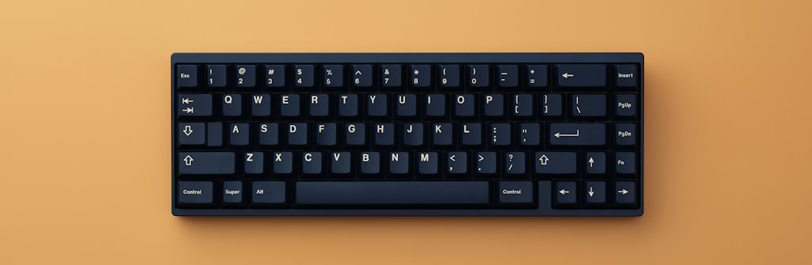](https://markerchun.com/neo65)

Don't keep up with this growing market where every couple of month there is a new project promising high quality at lower and lower prices – like the amazing keyboard kits we are currently seeing around 150 Euros[^neo] [^neo2] [^cycle].

[^neo]: MarkerChun – Keyboard Photographer [Neo70](https://www.youtube.com/watch?v=dKzmXDh5stQ)
[^neo2]: neo keyboard [ne0_kb instagram](https://www.instagram.com/ne0_kb/)
[^cycle]: TKD [Cycle8](https://www.zfrontier.com/app/flow/6ZgkWBBEaAp8)

[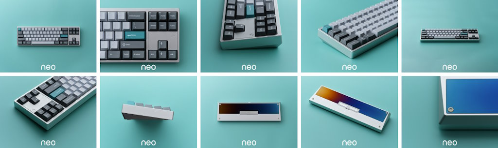](https://markerchun.com/neo70)

Don't go to keyboard meetups, where you can see and try out tons of keyboards and switches and could potentially get some dumb ideas for your wish list.

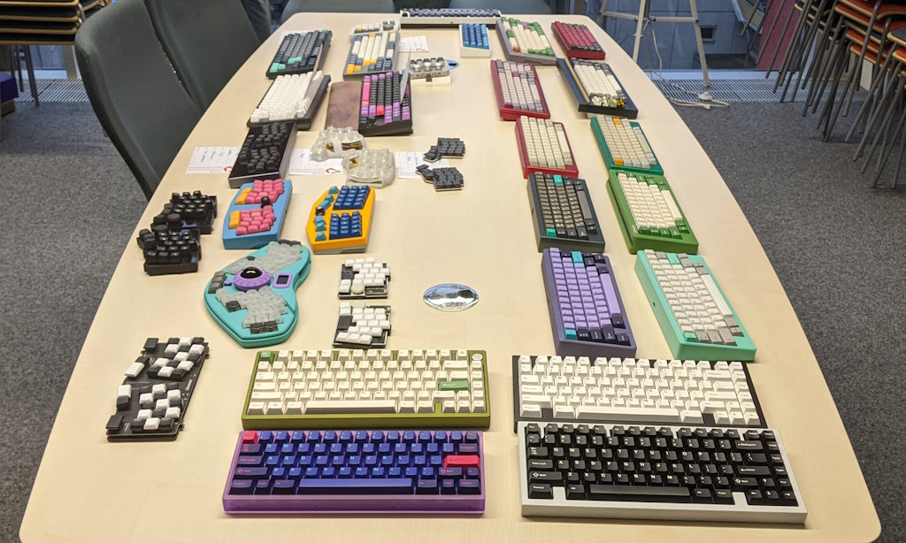

Be happy with the cheap piece of shit keyboard you are using and don't follow me down the rabbit hole ;)

The problem with custom keyboards is that you don't know what exactly you want.
It's hard to predict how any combination of keyboard kit, keycaps, plate, and switches sounds and feels like.
So you need to experiment with a number of different options.
And a year later you wonder if you really should have bought half a dozen expensive keyboards...

At least it's cheaper than getting into watches :)
