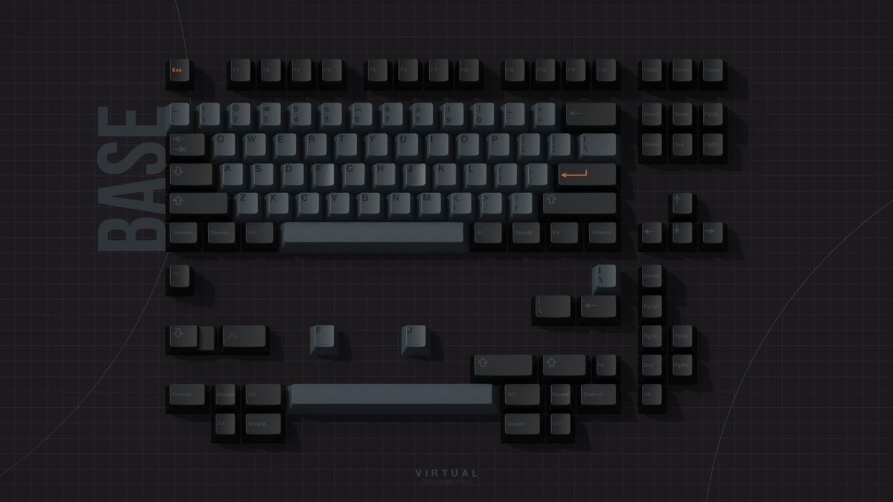
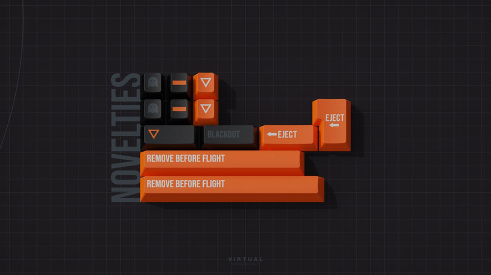
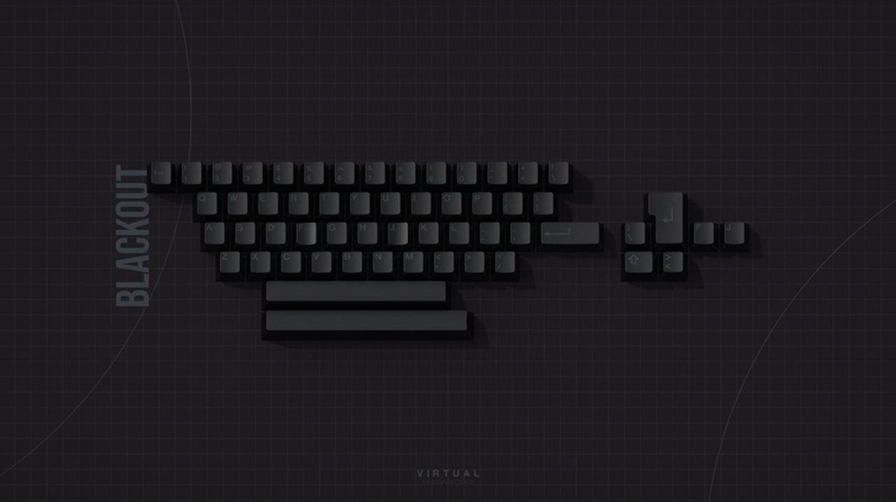
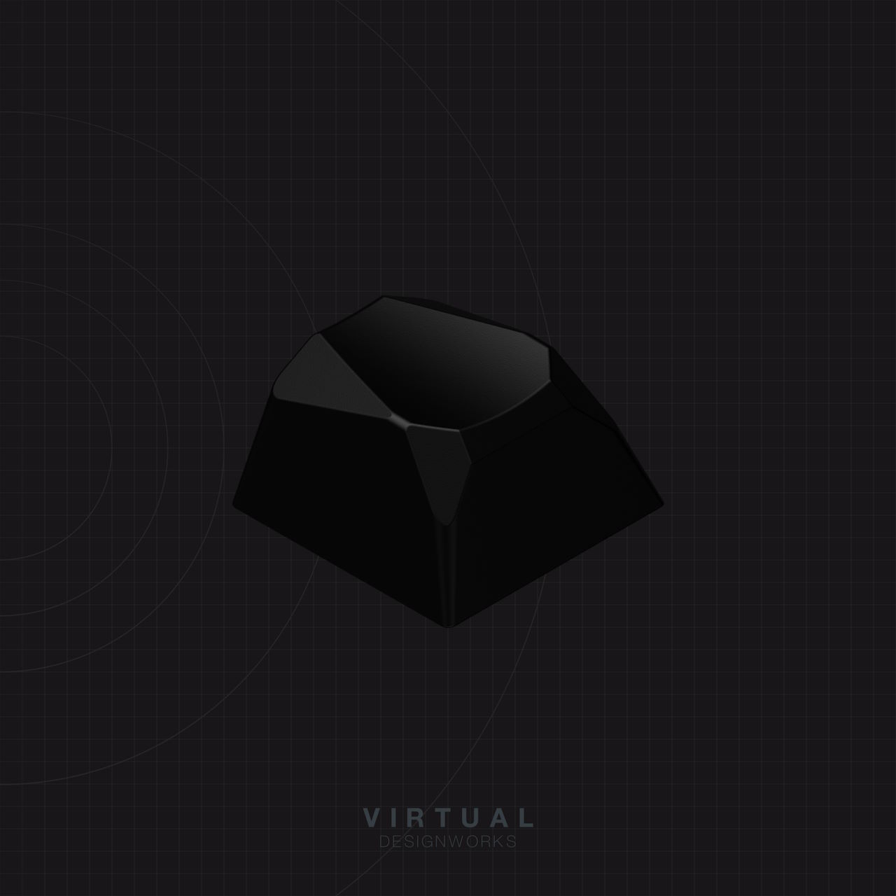
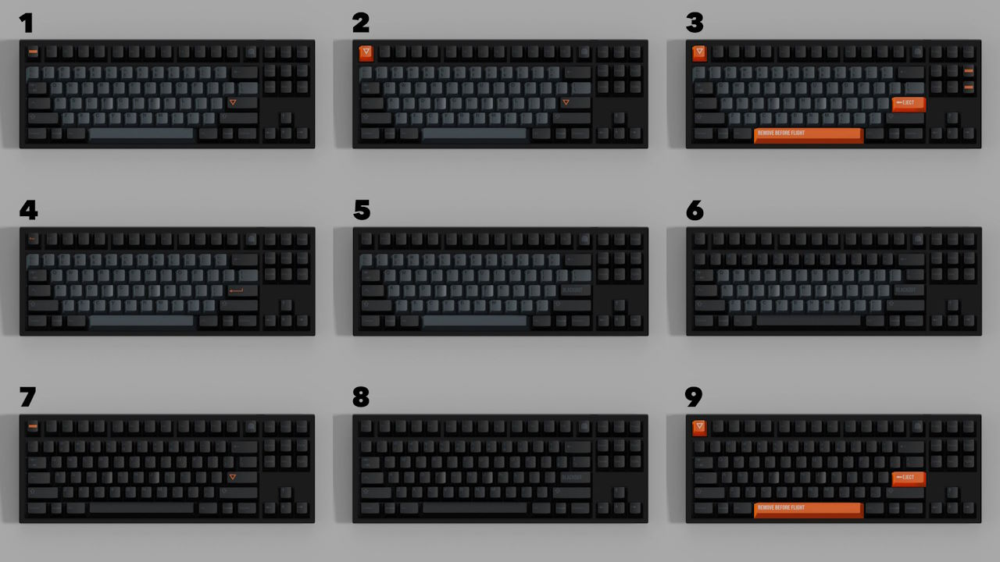
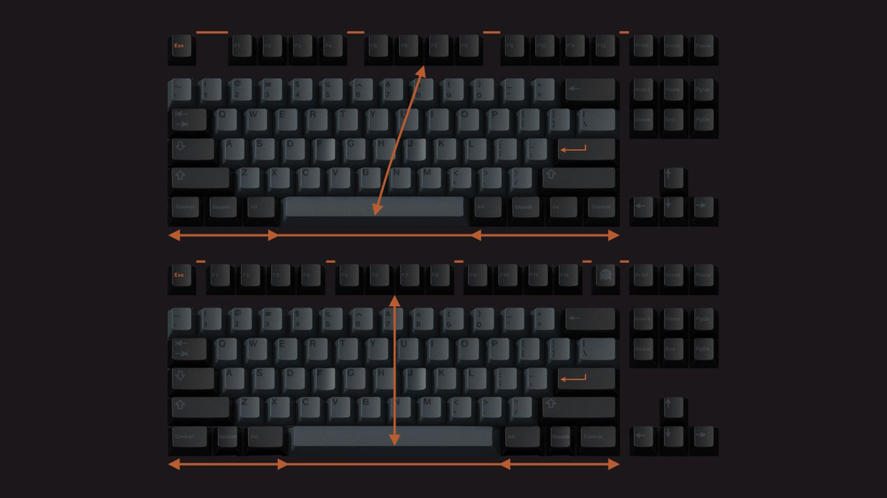
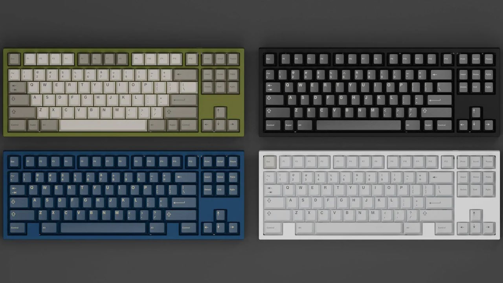
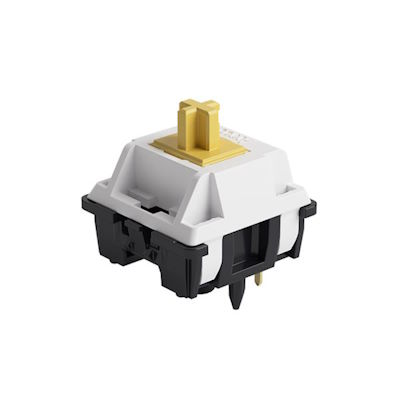
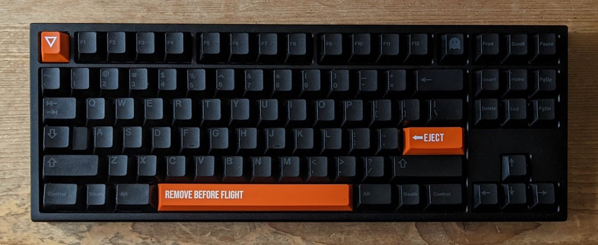
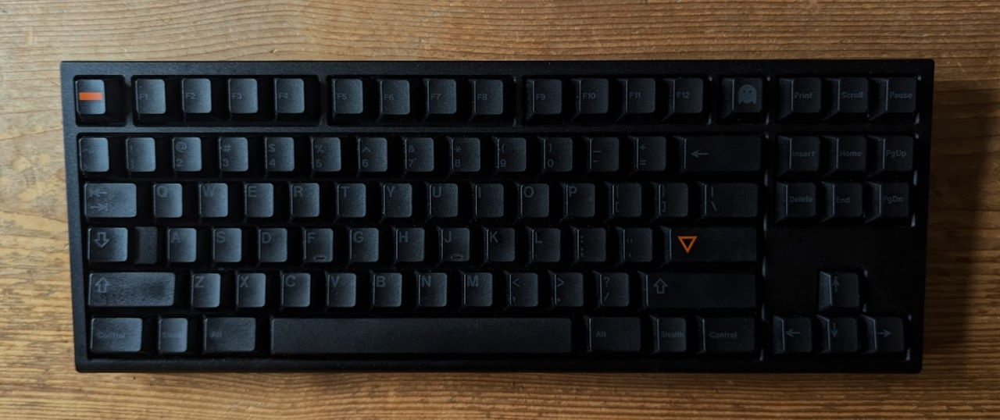

For years, I used a simple ~100 Euro pre-built mechanical keyboard with clicky Cherry MX Blue switches at home, and a simple ~100 Euro pre-built mechanical keyboard with Cherry MX Brown switches at work.
When COVID started, working from home with the loud clicky keyboard was not ideal:
you could hear the typing in video calls, and the compact 75% layout was cumbersome for the IDE shortcuts I was used to.
So I went keyboard shopping and stumbled on the vast amount of customization options to build keyboards to your preferences...

## GMK Stealth




The GMK Stealth[^stealth_matrixzj] keycaps spoke to me.
With their stealth theme, they are relatively subtle – mostly black and gray with orange accents.
I like that the set used the same colors for F1–F4, F5–F8, and F9–F12.

GMK produces premium keycaps made in Germany – but they don't come cheap.
The keycaps use the popular Cherry profile.
They are made from ABS plastic in a double-shot process for great colors and sharp legends that don't rub off.

The design of GMK Stealth took inspiration from stealth airplanes.
The modifier keys use subtle gray-on-black colors, whereas the alphas use black-on-gray.
With a nice orange accent color.
An optional "Blackout" kit adds gray-on-black alpha keycaps to allow you to turn all keys gray-on-black.
The optional "Novelties" kit adds some contrast with bold orange aircraft-inspired accents.

I liked the colors, the theme, and the novelties.
So I ordered some really expensive keycaps for the first time: the base kit for 110 Euros, and the Novelties for 40 Euros.
In the end, I got "scared" that would not like the look with the gray alphas in typical lighting conditions, so I also ordered the overpriced Blackout kit for 90 Euros.
At some point, I said "fuck it" and also purchased the matching metal artisan keycap for more money than anyone should pay for a single keycap.




While it's mostly _stupid_ to spend that much on keycaps,
you can find some solace in how they allow you to customize your keyboard.



GMK Stealth was sold in a group buy from December 2020 to January 2021 with an ETA of Q4 2021 (see [^stealth_geekhack]).
After some delays, it took a bit over two years from the time of purchase to receiving the set: I received it in February 2023.

[^stealth_matrixzj]: Keycaps Info From Matrix [GMK Stealth information](https://matrixzj.github.io/docs/gmk-keycaps/Stealth/)
[^stealth_geekhack]: FaKe_VirTual on geekhack.org [GMK Stealth group buy thread](https://geekhack.org/index.php?topic=110195.0)

## F13 TKL, 7u Spacebar, ANSI

My ideal keyboard layout for work and programming is a "tenkeyless" TKL layout.
I don't need the numbers block on the right and I prefer the aesthetics without it.

I prefer the symmetry of the "Tsangan" bottom row with a 7-unit wide spacebar and three keys on each side.
In addition, I favor layouts with an F13 key for added symmetry and consistent spacing.



I exclusively use the ANSI layout:
I initially chose it for the easy access to special characters you commonly use for programming (`[],{},<>,;,:`).
I have since stopped using QWERTY (in favor of Colemak), but I still prefer the wider left shift key and the slimmer enter key.
For customizing keyboards, ANSI has an added advantage: QWERTY is the default.
Additional kits to turn a QWERTY keycap set into the German QWERTZ are often not available and generally not cheap.

## Freebird TKL



|  |  |
| ---- | ---- |
| Keyboard kit | Freebird TKL by KeebsForAll |
| Case | E-Coated CNC machined 6063 Aluminum Case (black) |
| Layout | F13 TKL |
| Typing angle | 6° |
| Plate | POM |
| Mounting options | Top mount or gummy o-ring mount |

A matte black, e-coated aluminum keyboard kit with an understated, classic design was an ideal match for the Stealth theme.

The Freebird TKL by KeebsForAll was one of the most recommended "budget" keyboard kits (at 240 Euros) when the group buy ran at the end of 2021. It is simple but not without ambitions.

The case has no in-your-face branding or other decorative elements. The bottom of the keyboard is plain.
It shows it premium aspirations in more subtle ways:
with the nicely beveled edges on the top case and the curve in the side profile that make the board easier to pick up.

The Freebird TKL offers a good amount of layout options with the hot-swap PCB.
You can choose between a regular bottom row with a 6.25u spacebar and the "Tsangan" bottom row with a 7u spacebar.
You can choose between a regular caps lock key, or a stepped caps lock key.
You can opt for split backspace and right shift keys.

The kit provides two mounting options.
In the "top mount" configuration, you screw the assembly of the plate and PCB to the top case.
In the "o-ring mount" configuration, you wrap a rubber ring around the assembly and let it rest on the bottom case – well isolated from the case.
The way you mount the assembly affects both the feel and the sound (see [^mounting-styles]).

[^mounting-styles]: Keyboard University [Keyboard Mounting Styles](https://www.keyboard.university/200-courses/keyboard-mounting-styles-4lpp7)

The Freebird TKL was sold in a group buy from December 2021 to January 2022 for 240 Euros.
You could choose between four colors (black, white, olive, navy), a number of plate materials (Aluminum, POM, FR4, PC, Brass). KeebsForAll also offered the keyboard in Win Key Less (WKL) layouts – without keys at the "windows key" positions.[^fbtkl-gb]

[^fbtkl-gb]: Freebird TKL Group Buy on reddit [[GB] Freebird TKL by KeebsForAll](https://www.reddit.com/r/mechmarket/comments/r8yek6/gb_freebird_tkl_by_keebsforall/)

The downside of the group buy format is that you have to wait for the items to be manufactured.
In the case of the Freebird TKL, this took about a year: I received the keyboard in December 2022.

This group buy had some issues.
I was one of the lucky customers: I ordered the black version with ANSI plates and everything worked out for me.
Other customers were not so lucky.
The first major issue was that the navy and olive colors did not come out as intended. KeebsForAll offered to have the cases re-coated. This took months.
The second issue was that the plates for ISO layouts did not fit, so customers had to wait for months for replacement plates.

## Akko Penguin Silent Tactile Switches



|  |  |
| ---- | ---- |
| Switch type | Silent Tactile |
| Top housing material | PA |
| Bottom housing material | PA |
| Stem material | POM |
| Spring | 19.5mm long springs |
| Operating Force | 50gf |
| Bottom-out Force | 65gf |
| Pre-travel distance | 2.0mm |
| Total travel distance | 3.3mm |

They are great out of the box.
No need to lube them by hand.

Silent switches fit the stealth theme of the keyboard.

## The Build

First, I tried the popular Boba U4 silent switches to stay with the Stealth theme.
I spent at least five hours lubing all switches by hand.
Unfortunately, I learned that I am not the biggest fans of silent switches.
While they don't make a lot of noise, I don't like the little bit of noise they do make.

I tested the switches in both the o-ring mount configuration and the top mount configuration. It pretty quick and painless to change the configuration.
The top mount configuration with the POM plate had some noticeable "bounciness" / vibrations and brought out the "scratchy" sound of the silent switches.
The o-ring mount was an improvement: stiffer, and with a more muted sound profile.
I used this configuration for a few months but then decided to replace the silent switches.

For a long time, I used the board with Haimu Trash switches.
They sounded and felt good on the board.
In the end, I went back to silent tactile switches.
I wanted silent switches on one of my keyboards and the stealth theme was a perfect fit.

I used the keycaps in different combinations.
With and without blackout kit and with different configurations of novelties.



As a finishing touch, I spray painted the white POM plate black so that it is not visible through the gaps between the keycaps.

## The Bill

```plain
Freebird TKL                                    240 EUR
GMK Stealth (Base, Blackout, Novelties)         240 EUR
Akko Penguin switches                            42 EUR
Staebies stabilizers                             25 EUR
-------------------------------------------------------
                                                547 EUR
```

Since this was my first custom keyboard, there were some additional costs:

- Tools: switch opener, keycap fuller, brush, tweezers
- Lube: Krytox 205g0 and Tribosys 3203
- Paint to paint the POM plate black to match the theme

All-in-all I spent around 100 Euros on top of the keyboard parts.
I also purchased a set of Boba U4 silent switches and later sold them used.

## The Result



Looks, feels, and sounds like a keyboard – would recommend!

|  |  |
| ---- | ---- |
| Keyboard Kit   | Freebird TKL, black |
| Plate material | POM, painted black |
| Mounting style | O-ring mount |
| Keycaps | GMK Stealth |
| Switches | Akko Penguin |
| Stabilizers | Staebies V2 |
| Foam | – |
| Weight | 1.68kg |

The keyboard turned out great.

The heavy aluminum keyboard feels "premium".
You could definitely murder someone with this keyboard – exactly what I was looking for ;)

I intend to keep the keyboard in its current configuration.
