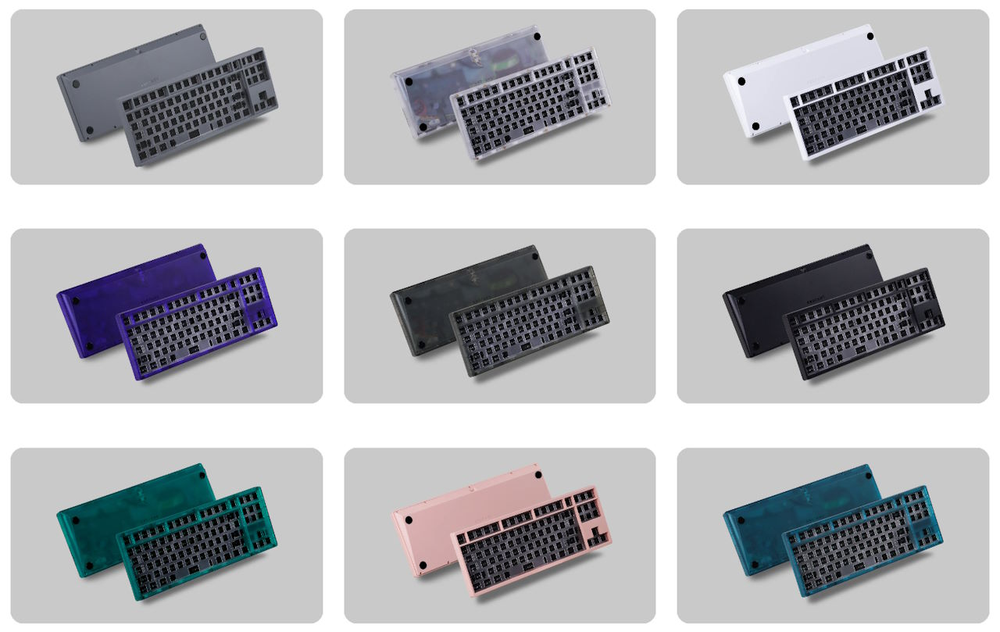
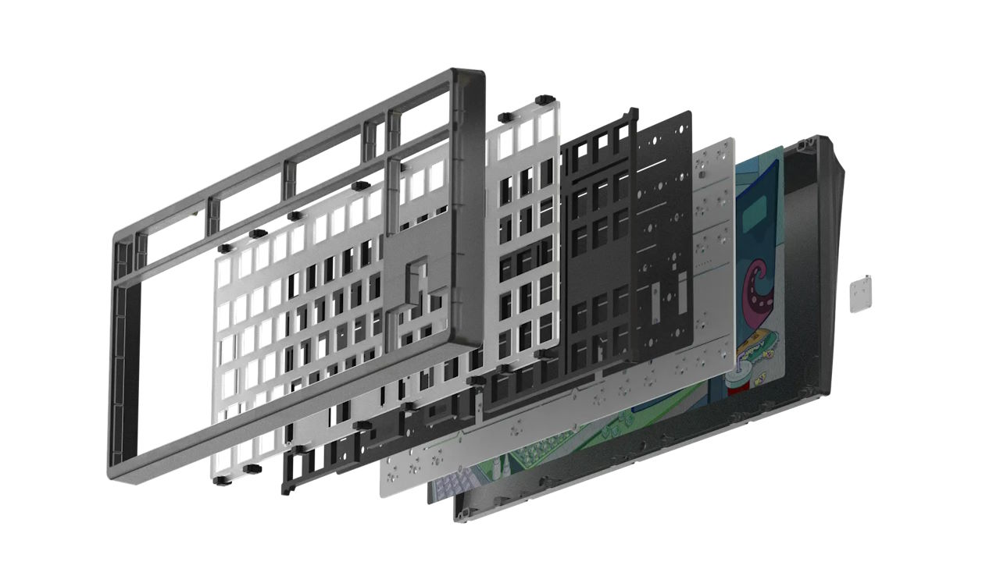
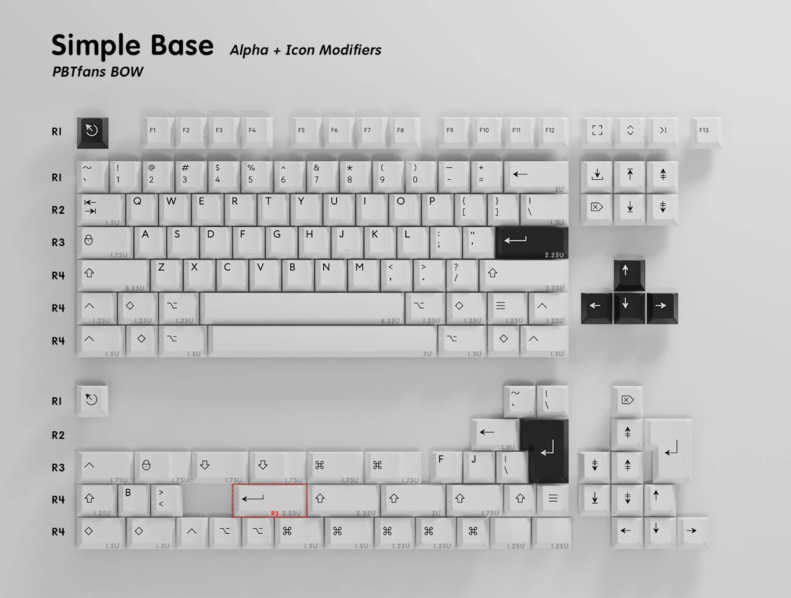
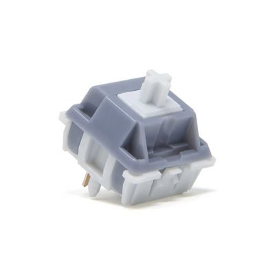
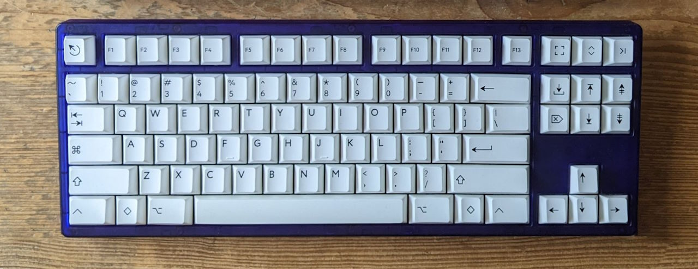

> It's all about preferences  
> — Everyone in the keyboard "hobby"

The good / bad thing about custom keyboards is that you can customize them exactly to your preference.
The problem is that you don't know your preferences before you try a lot of things.

Should the keyboard be on the stiffer side or have some "flex" or "bounce"?
Should it sound "clacky", "thocky", "marbly", "creamy", ...?
What spring weight do you prefer?
What keycap profile do you prefer?
...

One proven way to discover your preferences is to spend more money and time on keyboards ;)

## KBDfans Tiger 80 Lite

|  |  |
| ---- | ---- |
| Keyboard kit | KBDfans Tiger 80 Lite |
| Case | ABS plastic, translucent |
| Layout | F13 TKL |
| Typing angle | 7° |
| Plate | PC |
| Mounting options | Gasket mount |
| Lights | RGB underglow |




The Tiger80 Lite[^kbdfans_tiger] was one of the most recommended budget keyboard kits of 2022.
Where most custom keyboards go for the premium feel of an aluminum case, the Tiger80 Lite is made from ABS plastic.
It's light. It's translucent. It's colorful.  
It's different!

In addition to looking different, the Tiger80 Lite also feels and sounds different than my first keyboard.
The gasket mount with the flexible PC plate makes the board softer and gives it some "flex".
The plastic case may lend itself to a deeper sound profile.

The keyboard scene has an active aftermarket.
People try stuff and sell what they don't like.
People who bought too many keyboards sell some of them.
That way you can find some good deals without having to wait for months or years.

I bought the kit lightly used from a keyboard enthusiast who had too many keyboards.
I paid 120 Euros for the kit (100 Euros), an additional second case (15 Euros) in a different color, and shipping.

[^kbdfans_tiger]: kbdfans.com [Tiger 80 Lite](https://kbdfans.com/products/kbdfans-tiger-lite-keyboard-kit)

## PBTfans Black on White (BoW)



I went looking for a keycap set to complement the translucent purple.
With the colorful keyboard case, I opted for simple, classic black-on-white keycaps: PBTfans BoW[^pbtfans_bow].

[^pbtfans_bow]: kbdfans.com [PBTfans BoW](https://kbdfans.com/products/pbtfans-doubleshot-bow)

PBTfans is a sub-brand of KBDfans focusing on PBT keycaps.
The double-shot PBT keycaps are said to be more resilient than ABS keycaps.
The keycaps should be less prone to discoloration from sunlight and to become "shiny" from heavy use.
The thick PBT keycaps produce lower-pitched sound compared to ABS.

PBTfans use a thinner and more geometric font compared to GMK.
They offer versions with only symbols on the modifier keys.

I bought the keycaps for 90 Euros – in-stock without having to wait a few years.

## Owlab Tungsten



|  |  |
| ---- | ---- |
| Switch type | Linear |
| Top housing material | Nylon PA6 |
| Bottom housing material | Nylon PA66 |
| Stem material | POM |
| Spring | 17mm long springs |
| Bottom-out Force | 63.5gf |
| Pre-travel distance | 2.0mm |
| Total travel distance | 3.8mm |

The Owlab Tungstens[^tungsten] come unlubed and don't sound great stock.
But once you manually apply lube, they feel smooth and sound good.

I liked them on the Tiger80 Lite with PE foam.

[^tungsten]: Keyboard Enthusiast [Owlab Tungsten Switches: Usage Report](https://keyboardenthusiast.substack.com/p/owlab-tungsten-switches-usage-report)

## The Build

For my second keyboard, I started the switch selection process with a switch tester.
I bought one switch each for 20+ types of switches and tried all switches directly on the Tiger80 Lite.

I chose the Owlab Tungsten switches.
I ordered 100 of them and lubed them by hand with Krytox 205g0.

To make the keyboard as different as possible from my first keyboard, I used all foams that came with the keyboard.
A thin sheet of PE foam between the PCB and the switches filters out higher sound frequencies and leads to a "marbly" sound signature.[^pe_nearlucid][^pe_keybored] Another piece of foam between the PCB and the plate made it a bit more convenient to insert the switches.

[^pe_nearlucid]: nearLucid [PE Foam Mod Explained: An Ingenious Design](https://www.youtube.com/watch?v=XnQMXVchnrU)

[^pe_keybored]: keybored [PE Foam Vs. No PE Foam For Jelly Evolv?](https://www.youtube.com/watch?v=yN27mCdj87k)

The Tiger80 Lite comes with an optional sheet of "tape" for the "tape mod".
You can stick the tape to the bottom of the PCB to adjust the sound profile.
Instead of the bundled tape I tried the classic tape mod approach with some painter's tape.
I noticed that the tape did not change the sound significantly when you already used the FE foam.

## The Bill

```plain
Tiger 80 Lite keyboard kit                      120 EUR
PBTfans BoW                                      90 EUR
Owlab Tungsten switches                          70 EUR
TX AP 1.2mm stabilizers                          25 EUR
-------------------------------------------------------
                                                305 EUR
```

Compared to my first custom keyboard, this one was a bargain.
With a cheaper kit bought on the aftermarket and the reasonably priced PBTfans keycaps, you could create a great build for less than 250 Euros. I went a bit above that with switches and stabilizers that are on the expensive side.

## The Result



Looks, feels, and sounds like a keyboard – would recommend!

|  |  |
| ---- | ---- |
| Keyboard Kit | Tiger 80 Lite |
| Plate material | PC |
| Mounting style | Gasket |
| Keycaps | PBTFans BoW |
| Switches | Owlab Tungsten |
| Foam | Case foam, PE foam, plate foam |
| Mods | Tape mod |
| Weight | 0.65kg |

The keyboard feels and sounds significantly different than my Freebird TKL.
Switching between the two from time to time adds some variety.

I was a bit disappointed by the supposedly high amount of flex.
I've seen people sell the board because it has "too much flex", but to me it feels rather subtle.
I'm not a heavy typist, so the softer mount and plate do not feel all that different to me compared to a stiffer board.

For a daily driver, I prefer a higher-pitched, non-marbly, non-creamy sound with switches that are lighter than the 63g Tungstens.
It's a great keyboard to take to the office: it's light and the plastic doesn't feel as fragile as a more expensive keyboard where you could scratch the coating.

I'm happy with how it turned out.
