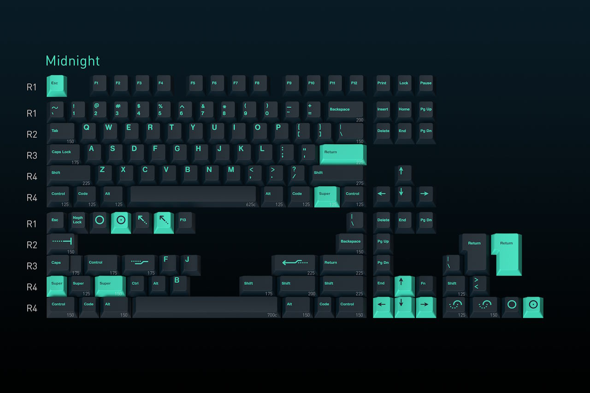
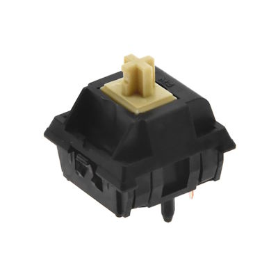
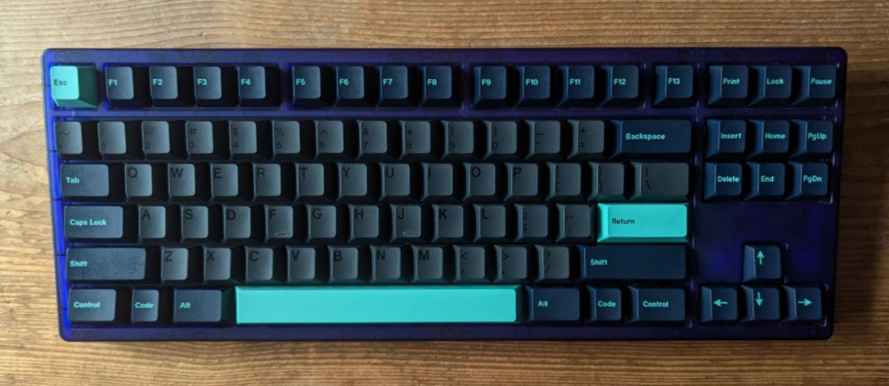

> It's all about preferences  
> — Everyone in the keyboard "hobby"

The good / bad thing about custom keyboards is that you can customize them exactly to your preference.
The problem is that you don't know your preferences before you try a lot of things.

Should the keyboard be on the stiffer side or have some "flex" or "bounce"?
Should it sound "clacky", "thocky", "marbly", "creamy", ...?
What spring weight do you prefer?
What keycap profile do you prefer?
...

One proven way to discover your preferences is to spend more money and time on keyboards ;)

## KBDfans Tiger 80 Lite

|  |  |
| ---- | ---- |
| Keyboard kit | KBDfans Tiger 80 Lite |
| Case | ABS plastic, translucent (purple) |
| Layout | F13 TKL |
| Typing angle | 7° |
| Plate | PC |
| Mounting options | Gasket mount |
| Lights | RGB underglow |


The Tiger80 Lite[^kbdfans_tiger] was one of the most recommended budget keyboard kits of 2022.
Where most custom keyboards go for the premium feel of an aluminum case, the Tiger80 Lite is made from ABS plastic.
It's light. It's translucent. It's colorful.  
It's different!

In addition to looking different, the Tiger80 Lite also feels and sounds different than my first keyboard.
The gasket mount with the flexible PC plate makes the board softer and gives it some "flex".
The plastic case may lend itself to a deeper sound profile.

The keyboard scene has an active aftermarket.
People try stuff and sell what they don't like.
People who bought too many keyboards sell some of them.
That way you can find some good deals without having to wait for months or years.

I bought the kit lightly used from a keyboard enthusiast who had too many keyboards.
I paid 120 Euros for the kit (100 Euros), an additional second case (15 Euros) in a different color, and shipping.

[^kbdfans_tiger]: kbdfans.com [Tiger 80 Lite](https://kbdfans.com/products/kbdfans-tiger-lite-keyboard-kit)

## PBTfans Black on White (BoW)


I went looking for a keycap set to complement the translucent purple.
With the colorful keyboard case, I opted for simple, classic black-on-white keycaps: PBTfans BoW[^pbtfans_bow].

[^pbtfans_bow]: kbdfans.com [PBTfans BoW](https://kbdfans.com/products/pbtfans-doubleshot-bow)

PBTfans is a sub-brand of KBDfans focusing on PBT keycaps.
The double-shot PBT keycaps are said to be more resilient than ABS keycaps.
The keycaps should be less prone to discoloration from sunlight and to become "shiny" from heavy use.
The thick PBT keycaps produce lower-pitched sound compared to ABS.

PBTfans use a thinner and more geometric font compared to GMK.
They offer versions with only symbols on the modifier keys.

I bought the keycaps for 90 Euros – in-stock without having to wait a few years.

## Owlab Tungsten


|  |  |
| ---- | ---- |
| Switch type | Linear |
| Top housing material | Nylon PA6 |
| Bottom housing material | Nylon PA66 |
| Stem material | POM |
| Spring | 17mm long springs |
| Bottom-out Force | 63.5gf |
| Pre-travel distance | 2.0mm |
| Total travel distance | 3.8mm |

The Owlab Tungstens[^tungsten] come unlubed and don't sound great stock.
But once you manually apply lube, they feel smooth and sound good.

I liked them on the Tiger80 Lite with PE foam.

[^tungsten]: Keyboard Enthusiast [Owlab Tungsten Switches: Usage Report](https://keyboardenthusiast.substack.com/p/owlab-tungsten-switches-usage-report)

## The Build

For my second keyboard, I started the switch selection process with a switch tester.
I bought one switch each for 20+ types of switches and tried all switches directly on the Tiger80 Lite.

I chose the Owlab Tungsten switches.
I ordered 100 of them and lubed them by hand with Krytox 205g0.

To make the keyboard as different as possible from my first keyboard, I used all foams that came with the keyboard.
A thin sheet of PE foam between the PCB and the switches filters out higher sound frequencies and leads to a "marbly" sound signature.[^pe_nearlucid][^pe_keybored] Another piece of foam between the PCB and the plate made it a bit more convenient to insert the switches.

[^pe_nearlucid]: nearLucid [PE Foam Mod Explained: An Ingenious Design](https://www.youtube.com/watch?v=XnQMXVchnrU)

[^pe_keybored]: keybored [PE Foam Vs. No PE Foam For Jelly Evolv?](https://www.youtube.com/watch?v=yN27mCdj87k)

The Tiger80 Lite comes with an optional sheet of "tape" for the "tape mod".
You can stick the tape to the bottom of the PCB to adjust the sound profile.
Instead of the bundled tape I tried the classic tape mod approach with some painter's tape.
I noticed that the tape did not change the sound significantly when you already used the FE foam.
Since it didn't make much of a difference, I kept the tape in.

I used TX AP stabilizers for 1.2mm PCBs.
I was not fully successful with tuning the stabilizers for the spacebar.
After my great experience tuning the Staebies spacebar for my Freebird TKL, I used a leftover Staebies stabilizer for the spacebar of the Tiger80 Lite.

## The Bill

```plain
Tiger 80 Lite keyboard kit                      120 EUR
PBTfans BoW                                      90 EUR
Owlab Tungsten switches                          70 EUR
TX AP 1.2mm stabilizers                          25 EUR
-------------------------------------------------------
                                                305 EUR
```

Compared to my first custom keyboard, this one was a bargain.
With a cheaper kit bought on the aftermarket and the reasonably priced PBTfans keycaps, you could create a great build for less than 250 Euros. I went a bit above that with switches and stabilizers that are on the expensive side.

## The Result


<figure class="w-content">
  <figcaption>Audio sample recorded with Sennheiser MKE 600 about 20cm above the keyboard pointing down:</figcaption>
  <audio controls src="/media/2024-08-19_keyboard_tiger.mp3"></audio>
</figure>

Looks, feels, and sounds like a keyboard!

|  |  |
| ---- | ---- |
| Keyboard Kit | Tiger 80 Lite |
| Plate material | PC |
| Mounting style | Gasket |
| Keycaps | PBTFans BoW |
| Switches | Owlab Tungsten |
| Stabilizers | TX AP 1.2mm |
| Foam | Case foam, PE foam, plate foam |
| Mods | Tape mod |
| Weight | 0.65kg |

The keyboard feels and sounds significantly different than my Freebird TKL.
Switching between the two from time to time adds some variety.

I love the look of the translucent purple case.
With its look and the light weight, it feels a bit more like a toy than other keyboards.
The PBTfans BoW keycaps are a good fit; they are neutral and leave the flashy look to the case.
On the dark purple board the black legends almost seem to match the case.

The switches feel pretty smooth but relatively heavy.
For writing long texts, I would prefer lighter switches but for my typical day-to-day use, the Tungstens are fine.

The board is comfortable to type on – but I was a bit disappointed by the supposedly high amount of flex.
I've seen people sell the board because it has "too much flex", but to me it feels rather subtle.

The keyboards sounds "interesting" to me.
With the PE foam and the Tungstens, it sounds decent and different than my other boards.
But it's not my favorite sound, either.

I'm happy with how it turned out.
In the future, I might try some other configurations using different keycaps or experimenting how it would sound with other switches I own.

## 2024-12-29: Changed keycaps and switches

I liked my Tiger80 Lite configuration but I haven't used the board much lately.
In addition, I wanted to try a new look and different sound profile.

Time for a change.

### GMK Stealth x GMK Metropolis




I've bought a couple of GMK keycap sets and their overpriced child kits:
I bought the Stealth Blackout kit[^gmk_stealth] (alphas) and the Metropolis Turnpike kit[^gmk_metropolis] (modifiers).
As a result, the base Stealth alphas and base Metropolis Midnight modifiers went unused.
I've been looking for a way to make use these "leftovers".
It turns out they work well together and look good on my Tiger80 Lite.

[^gmk_stealth]: [Keyboard 1: Freebird TKL + GMK Stealth](/blog/2024-08-18_keyboard_1_fbtkl/)
[^gmk_metropolis]: [Keyboard 7: Neo70 + GMK Metropolis](/blog/2024-08-24_keyboard_7_neo70/)

GMK Child kits are pricey. I paid around 160 Euros for the two child kits I used on the Freebird TKL and the Neo70. That's as much as another base kit.

### Keygeek Y3



|  |  |
| ---- | ---- |
| Switch type | Linear |
| Top housing material | Nylon PA6 |
| Bottom housing material | Nylon PA66 |
| Stem material | M3 |
| Spring | 20mm KOS extended single-stage spring |
| Operating Force | 48gf |
| Bottom-out Force | 53gf |
| Pre-travel distance | 2.0mm |
| Total travel distance | 3.8mm |

> The Y3 switch is smooth, deep, and solid.
> If you prefer something that is subtle and not too loud or harsh,
> the Y3 switches are a great option.
> — <cite>unikeyboards.com[^y3_unikeys]</cite>

[^y3_unikeys]: unikeyboards.com [Keygeek X MZ Y3](https://unikeyboards.com/en-de/products/keygeek-x-mz-y3-linear-switch-factory-lubed-edition-10pcs)

The Keygeek Y3s are one of my favorite recent switches.
I was tempted to use them in both my Cycle7 and Krush65, and now I immediately went looking for the next oppotunity to use them.

The Keygeek Y3s feel great. They are super smooth and this might be the perfect spring weight for me.
I like their deep sound.

I bought them second-hand in a pack of 90 for 18 Euros including shipping.

### The Updated Bill

The GMK keycaps increase the price for the build but the cheap switches partially make up for the difference.

```plain
Tiger 80 Lite keyboard kit                      120 EUR
GMX Stealth x Metropolis Midnight               160 EUR
Keygeek Y3 switches                              18 EUR
TX AP 1.2mm stabilizers                          25 EUR
-------------------------------------------------------
                                                323 EUR
```

### The Updated Result



<figure class="w-content">
  <figcaption>Audio sample recorded with Sennheiser MKE 600 about 20cm above the keyboard pointing down:</figcaption>
  <audio controls src="/media/2024-12-30_keyboard_tiger80_y3.mp3"></audio>
</figure>

|  |  |
| ---- | ---- |
| Keyboard Kit | Tiger 80 Lite |
| Plate material | PC |
| Mounting style | Gasket |
| Keycaps | GMK Stealth alphas x GMK Metropolis modifiers |
| Switches | Keygeek Y3 |
| Stabilizers | TX AP 1.2mm |
| Foam | Plate foam |
| Mods | – |
| Weight | 0.65kg |
