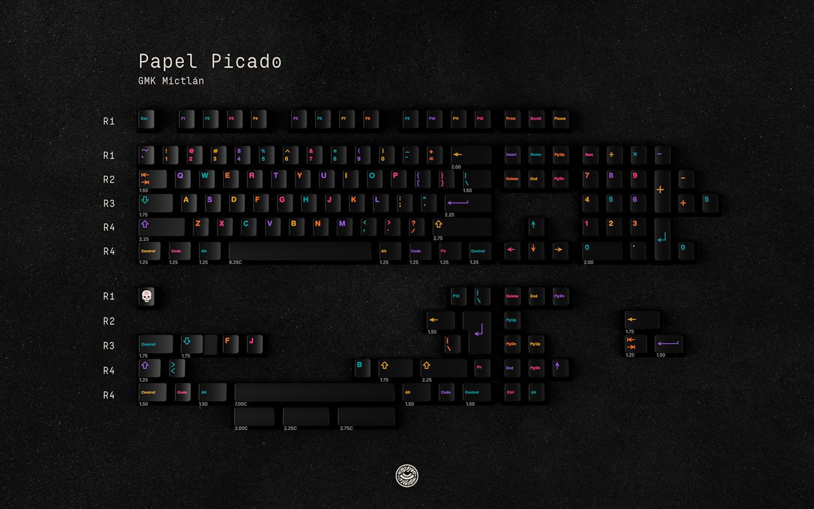
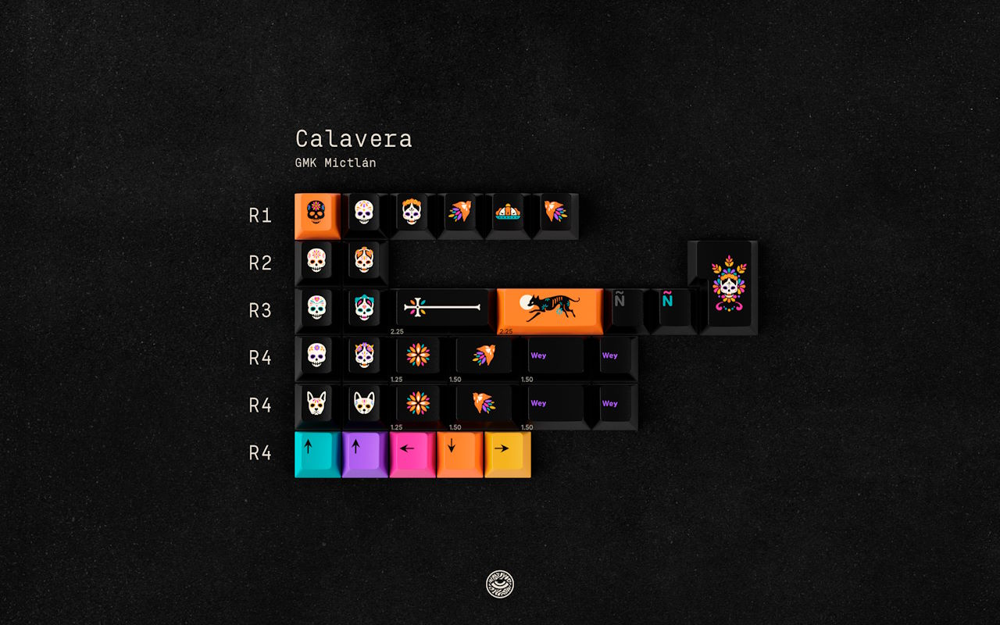
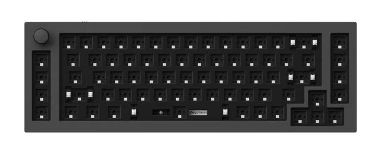
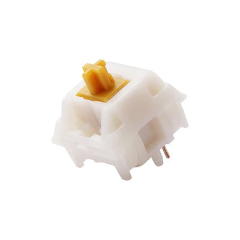
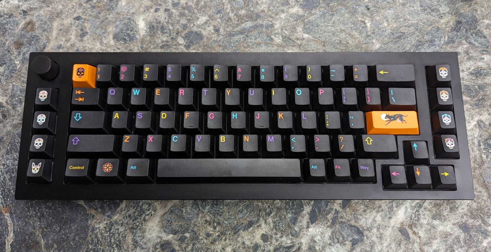
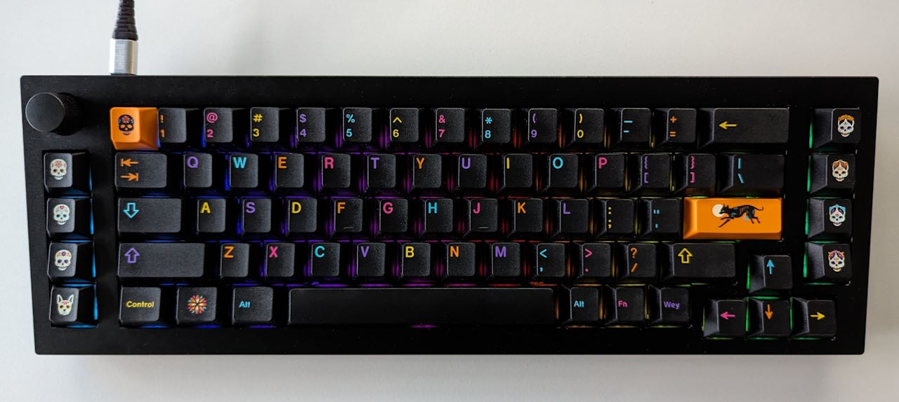

You'd think two overpriced keyboards should be enough.  
Why would anyone need more than two? Shouldn't one be enough?

Enter GMK Mictlán.

## GMK Mictlán




The GMK Mictlán[^mictlan_matrixzj] keycap set were inspired by the Mexican day of the dead.
The design of the set stands out. It's dark, but still colorful.
Mictlán arranges five legend colors in a way that no two neighboring keycaps use the same legend color.

The novelties kit goes all in on the theme with 11 unique skull designs.
It also features two outstanding Enter keycaps.
This kit makes it difficult to find a keyboard that can fit all the novelties you want to use.
I was almost tempted to buy two base kits to spread the novelties out over two boards.

GMK Mictlán is one of my favorite keycap sets.
Where many sets pick two to three colors that ideally look good together, Mictlán goes the extra mile.
It has a great theme and executes it well.

GMK Mictlán was sold in a group buy in June 2022 with an ETA of Q3 2023.[^mictlan_geekhack]
It shipped in October 2023.

Now to find a fitting keyboard kit...

[^mictlan_matrixzj]: Keycaps Info From Matrix [GMK Mictlán information](https://matrixzj.github.io/docs/gmk-keycaps/Mictlan/)
[^mictlan_geekhack]: vheissu on geekhack.org [GMK Mictlán group buy thread](https://geekhack.org/index.php?topic=117389.0)

## Keychron Q65



|  |  |
| ---- | ---- |
| Keyboard kit | Keychron Q65 |
| Case | Anodized, sandblasted CNC machined 6063 Aluminum Case (black) |
| Layout | 65% + extra column with knob |
| Typing angle | 6.5° |
| Plate | Steel |
| Mounting options | Gasket mount |
| Lights | Per-key RGB (south-facing) |

Keychron offers a wide range of "budget" keyboards.
They sell the Q series of aluminum keyboards in more than a dozen sizes / layouts.
The boards in the series use the same, simple designs with different layouts.
The keyboards are decent: they check a lot of boxes.
CNC aluminum case, gasket mounting, QMK & VIA support (to remap keys), south-facing RGB, ...

Keyboard enthusiasts don't see Keychron as true "custom" keyboards.
They offer a more industrialized approach to keyboards.
Not like the hobbyists that work on a keyboard for two years in their free time and then run a limited group buy with maybe a few hundred keyboards sold.

So why did I consider a Keychron when I already had two "better" keyboards?

I bought the Keychron Q65 specifically for GMK Mictlán.
The 65% layout with two columns at the sides fits the skull novelties nicely.
The plain black case gives the colorful legends room to shine.
And speaking of shine: the per-key RGB offers some lighting modes that work great with Mictlán.

The Keychron Q65[^keychron_q65] was initially sold for 210 Euros + international shipping.
I didn't plan on buying it – it's still "just a Keychron".
But then I saw it on the aftermarket.
The owner realized that the 65% was not a good fit for them.
So they sold it for 160 Euros.
I paid an additional 20 Euros to keep the Staebies stabilizers that were already installed and tuned.

[^keychron_q65]: keychron.com [Keychron Q65 QMK Custom Mechanical Keyboard](https://www.keychron.com/products/keychron-q65-qmk-custom-mechanical-keyboard)

## Gazzew U4T



|  |  |
| ---- | ---- |
| Switch type | Tactile |
| Top housing material | Custom mix |
| Bottom housing material | Custom mix |
| Stem material | POM |
| Spring | 17.5mm |
| Bottom-out Force | 65gf |
| Pre-travel distance | 1.7mm |
| Total travel distance | 3.1mm |

The Gazzew U4T[^gazzew_u4t] switches are some of the most popular tactile switches.
With 65g springs they are on the medium–heavy side.
They offer good tactile feedback following a kind of "D" shape:
the tactile "bump" starts at the top and goes down to the actuation point.
They have a relatively deep, low-pitched sound profile.

While the housings are not designed for RGB – they also offer RGB versions with transparent top housing – the white material works well with per-key RGB.

[^gazzew_u4t]: keygem.com [Gazzew U4T](https://keygem.com/products/gazzew-u4t-10pcs)

## The Build

There wasn't much to build – especially since I bought the Keychron with pre-installed stabilizers.
The main challenge for this keyboard was finding the "right" switches.

At first, I tried Gazzew's U4Tx switches.
They are like the U4Ts but "semi-silent": they mute the sound on the upstroke.
The problem was that my batch of switches was not very consistent.

Then I tried the popular Gateron Oil Kings.
They feel and sound great on the board.
One small issue: they block the RGB – not a deal breaker; just not ideal.

I tried the board with Gateron Melodics – clicky switches.
They are a good match for the board and great for RGB, but I found myself using the board less often with the clickies.

In the end I chose the Gazzew U4Ts.
I wanted to have tactile switches in one of my keyboards.
With the stiff steel plate, the Keychron seemed like a good fit.

## The Bill

```plain
Keychron Q65 keyboard kit                       160 EUR
GMK Mictlán (Papel Picado Base, Novelties)      170 EUR
Gazzew U4T switches                              60 EUR
Staebies stabilizers                             20 EUR
-------------------------------------------------------
                                                410 EUR
```

410 Euros is still pretty insane for a keyboard.
But looking at the components: of course GMK Mictlán is worth that much.
And 160 Euros for a decent aluminum keyboard kit is not unreasonable, either.

## The Result



Looks, feels, and sounds like a keyboard – would recommend!

|  |  |
| ---- | ---- |
| Keyboard Kit   | Keychron Q65 |
| Plate material | Steel |
| Mounting style | Gasket |
| Keycaps | GMK Mictlán |
| Switches | Gazzew U4T |
| Foam | Plate foam |
| Mods | Factory "tape mod" |
| Weight | 1.81kg |

The Q65 is a great match for Mictlán – it looks great.
The U4Ts sound and feel good on the heavy construction with the stiff steel plate.


