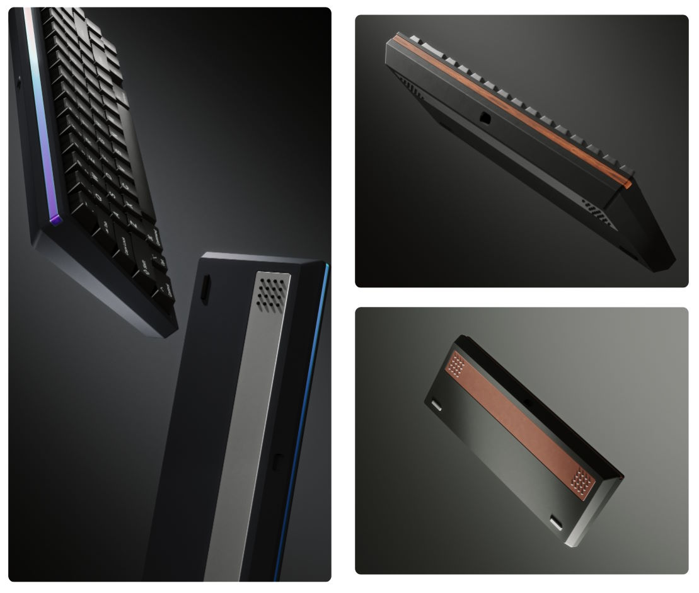
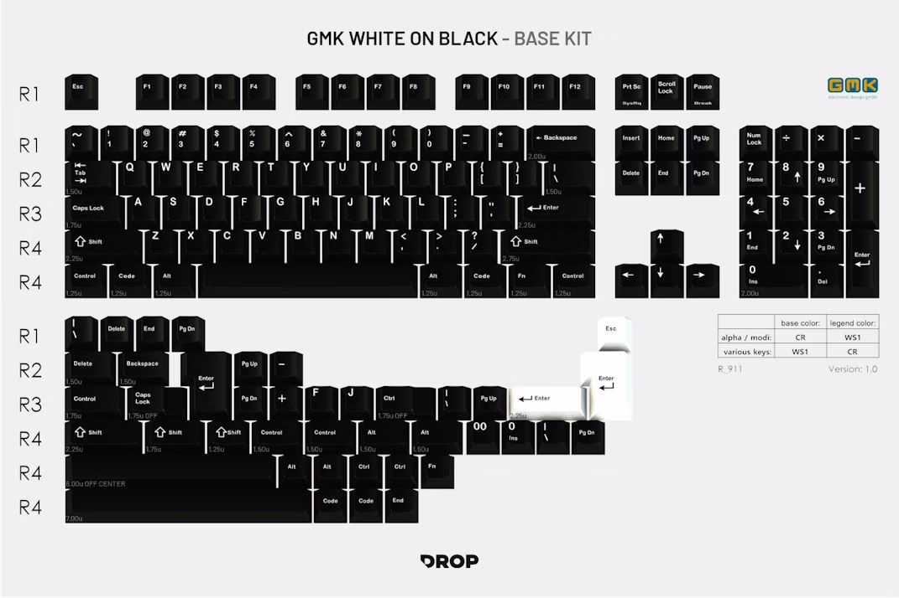
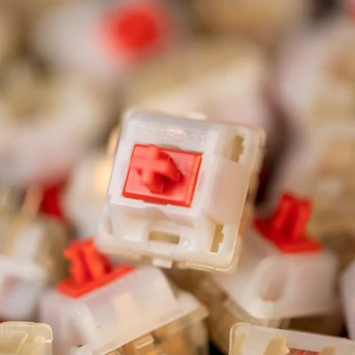
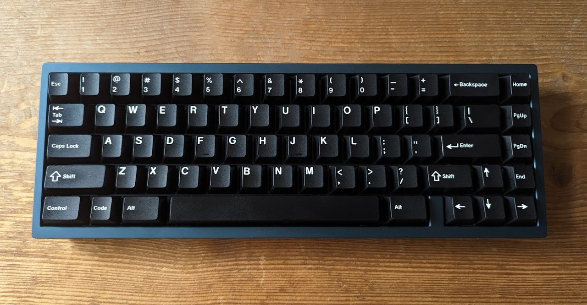
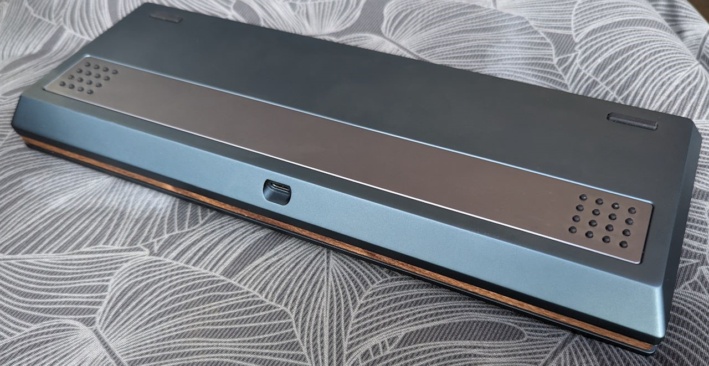

I've head my eyes on Mode keyboards for quite some time – especially on the Mode Sonnet.
Unfortunately, no European vendors sell Mode keyboards; you generally need to order from the US with high shipping costs.
With the Mode Envoy, Mode enlisted vendors for an international sale for the first time.

## Mode Envoy



|  |  |
| ---- | ---- |
| Keyboard kit | Mode Envoy |
| Case | Anodized aluminum (mirage) |
| Layout | 65% |
| Typing angle | 5.8° |
| Plate | Aluminum + POM |
| Mounting options | Lattice Block Mount |
| Lights | – |

The Mode Envoy[^mode_envoy] is a 65% "budget premium" kit by Mode Designs.
It comes in five colors with additional customization options through two accent pieces that are available in different colors and materials.

Mode generally target the medium-budget segment of the custom keyboard market with ambitious designs and lots of customization options.
With the Envoy, they managed to reach the "budget" price range starting below $200 by using a relatively simple unibody construction.

Despite the reasonable price tag, Mode introduced an innovative new mounting system: the Lattice Block Mount.
The plate rests on 3D printed "elastomeric blocks which offer a uniquely bouncy typing feel." [^mode_envoy]

The Envoy did well in reviews:
> The Mode Envoy is such a solid board I can’t imagine anyone regretting it if they bought one.  
> With its friendly price and unique mounting system there’s something here for the budget conscious as well as the experimenter.  
> — <cite>Alexotos[^alexotos_envoy]</cite>

I ordered the "mirage" blue kit (240 Euros) aluminum and POM plates (+18 Euros), as well as the foam kit (15 Euros).
I splurged on the customization options: I ordered a steel gray bottom accent (24 Euros), and a walnut wood accent (30 Euros) for the back of the board. I spent 327 Euros in total – quite a bit more than the board's entry price.

[^mode_envoy]: Mode Designs [Mode Envoy](https://modedesigns.com/pages/envoy)
[^alexotos_envoy]: Alexotos [Mode Envoy Review](https://www.alexotos.com/mode-envoy/)

## GMK White-on-Black (WoB)



To complement the Envoy with the wooden accent piece, I was looking for a classic colorway like beige or white-on-black.
I started with a beige set but then realized that I would prefer darker keycaps on the the dark blue case.

I bought a used set of GMK WoB[^wob_matrixzj][^wob_drop] for 100 Euros.

[^wob_matrixzj]: Keycaps Info From Matrix [GMK WoB information](https://matrixzj.github.io/docs/gmk-keycaps/White-on-Black/)
[^wob_drop]: drop.com [GMK WoB](https://drop.com/buy/gmk-white-on-black-custom-keycap-set)

## Gateron Cream Soda



|  |  |
| ---- | ---- |
| Switch type | Linear |
| Top housing | Milky |
| Bottom housing | INK |
| Stem material | POM |
| Spring | 18mm |
| Total travel distance | 3.8mm |

> Cream Sodas are designed to deliver the deep bottom out we all love
> in Ink housings and that marbly top out that graces all those boards filled with Milky switches.
> To accentuate these sounds the Cream Soda switch has been equipped with a long pole stem
> to bring out all the lovely goodness of these housing materials.
> — <cite>PuNkShoO[^cream_soda_geekhack]</cite>

Initially, I tried the Cream Sodas in multiple boards and did not like them.
I was almost ready to sell them again but then decided to give them another shot.
I lubed the switches with Krytox 205g0 grease to remove some unwanted noises and make the sound a bit deeper.
I realized that I prefer the Cream Sodas in builds with a low-pitched sound profile – with plastic plates and maybe a bit of foam.
Now, the Cream Sodas are among my favorite switches. I've tried them in multiple boards/builds, where they were among the top options for that build/board.

I bought the Cream Sodas second-hand with around 95 switches for 35 Euros.

[^cream_soda_geekhack]: PuNkShoO on geekhack.org [[GB] Gateron Cream Soda Switch](https://geekhack.org/index.php?topic=118388.0)

## The Build

I first built the Envoy with the aluminum plate and Cherry MX Black Clear Top switches without foam.
The idea was to use a "classic" configuration in combination with the classic look.
The configuration was good, but it was not my favorite board.
So I experimented some more.

I landed on a build with the POM plate, PCB foam, and the Cream Soda switches.

## The Bill

```plain
Mode Envoy keyboard kit                         330 EUR
GMK WoB                                         100 EUR
Cream Soda switches                              35 EUR
TX AP stabilizers                                25 EUR
-------------------------------------------------------
                                                490 EUR
```

## The Result



Looks, feels, and sounds like a keyboard – would recommend!

|  |  |
| ---- | ---- |
| Keyboard Kit   | Mode Envoy |
| Plate material | POM |
| Mounting style | Lattice Block mount |
| Keycaps | GMK WoB |
| Switches | Cream Sodas |
| Foam | PCB foam |
| Mods | – |
| Weight | 1.08kg |

The Envoy is one of my favorite keyboards.
The board looks great from every side and every angle.
The build with Cream sodas sounds and feels great.
It's light enough, compact enough, and quiet enough to take to the office, too.


