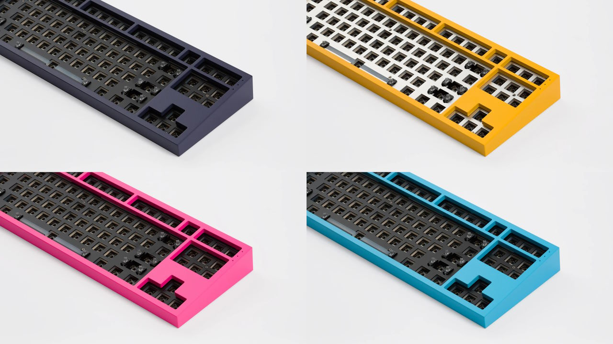
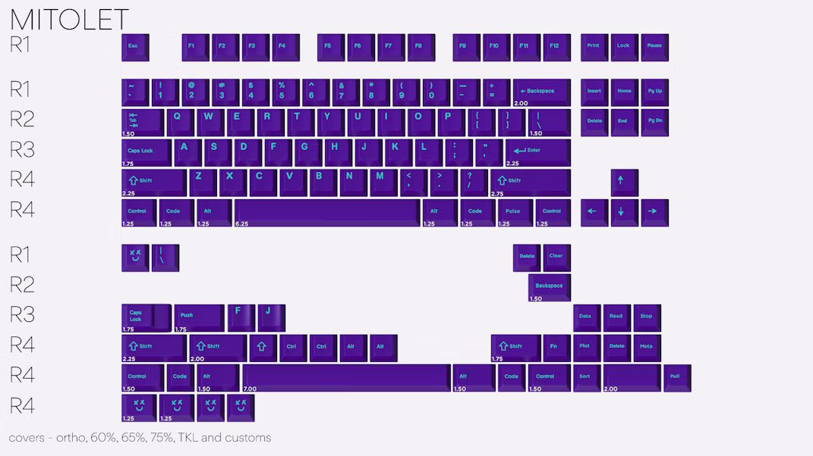
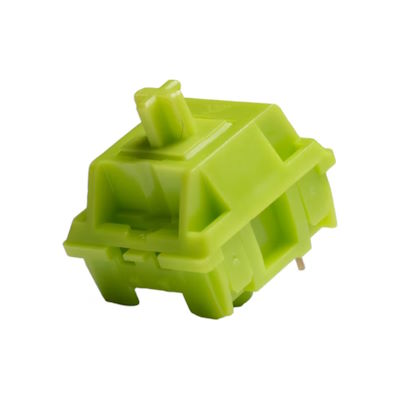
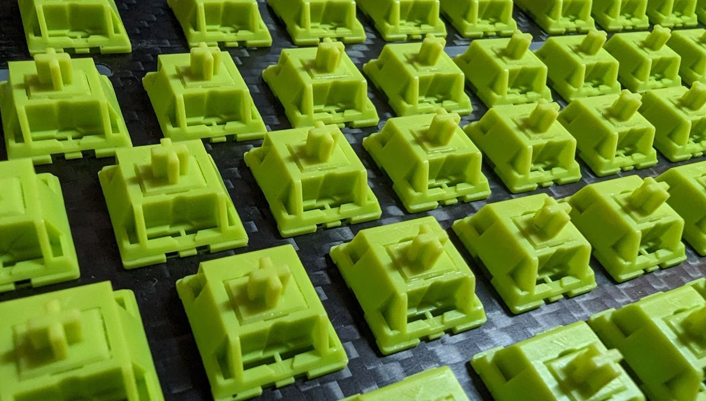
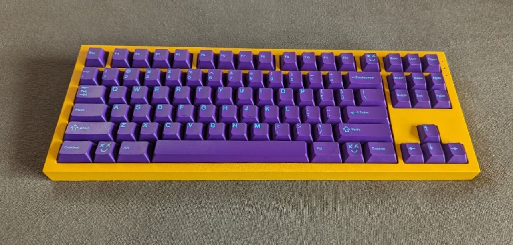
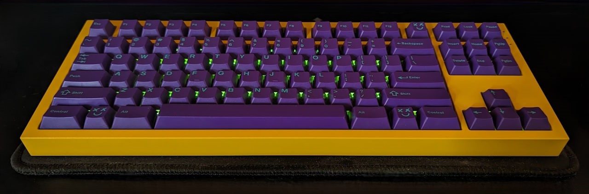

I found a bargain for one of my favorite keyboard designs.

## NovelKeys NK87 Aluminum Edition



|  |  |
| ---- | ---- |
| Keyboard kit | NovelKeys NK87 Aluminum Edition |
| Case | CNC machined aluminum with NovelKote (spray) coating ("Solar Yellow") |
| Layout | F13 TKL |
| Typing angle | 8° |
| Plate | Carbon Fiber |
| Mounting options | Top/Tray mount |
| Lights | Per-key RGB |

The NovelKeys NK87 Aluminum Edition[^nk87_novelkeys] is a TKL keyboard kit from 2021 with a fix layout with F13 and a 7u spacebar.

[^nk87_novelkeys]: NovelKeys [NovelKeys NK87 Aluminum Edition](https://novelkeys.com/collections/keyboards/products/nk87-aluminum-edition)

I love the design of the NK87.
It uses my favorite layout.
Its shape is geometric and clean – no curves to be found.
It comes in great, bold colors.

I considered the NK87 as an alternative to the Freebird TKL when I was looking for my first "custom" keyboard and chose the Freebird TKL.
Reviewers that compared the two preferred the Freebird.
Moreover, NovelKeys did not partner with European vendors – I would have had to order from the US.

The NK87 was announced[^nk87_reddit] at the beginning of 2021 with a pre-order price of $265.
At some point, NovelKeys made an improvement to the first batch of NK87s and sold the boards from the first revision in a clearance sale for just $75.
A German keyboard enjoyer grabbed that chance and imported the NK87 with an extra carbon fiber plate.
After collecting too many keyboards, he decided to part with the board and sold it to me for 70 Euros – a bargain.

[^nk87_reddit]: mgsickler on reddit.com [Introducing the NK87 Aluminum Edition](https://www.reddit.com/r/MechanicalKeyboards/comments/m0jdf1/introducing_the_nk87_aluminum_edition_preorders/)

## GMK Pulse Mitolet



I generally like simple colorways I did not have GMK Pulse Mitolet on my wish list.
GMK Pulse Mitolet[^mitolet_matrixzj] was a "purchase of opportunity".
I purchased some component from a fellow keyboard enjoyer and he also offered Mitolet at a good price.
At 70 Euros for an unused or little used GMK base kit, this was another bargain.

I didn't know if and when I would get to use the keycaps.
I envisioned them on a white or yellow keyboard.

[^mitolet_matrixzj]: Keycaps Info From Matrix [GMK Pulse Mitolet information](https://matrixzj.github.io/docs/gmk-keycaps/Pulse/)

## KTT Matcha



|  |  |
| ---- | ---- |
| Switch type | Tactile |
| Top housing material | PC |
| Bottom housing material | PC |
| Stem material | POM |
| Spring | 15mm gold-plated |
| Operating Force | 40gf |
| Bottom-out Force | 45gf |
| Pre-travel distance | 1.9mm |
| Total travel distance | 4.0mm |

KTT Matchas[^matcha_milktooth] are light tactile switches.

I was interested in trying some lighter tactile switches and saw some recommendations for the Matchas.
I lubed the switches with TriboSys 3203 grease to get rid of unwanted noises.

[^matcha_milktooth]: milktooth [KTT Matcha Tactile Switch](https://milktooth.nu/products/switches/matcha)

## The Build

I tried a number of switches I had and chose the KTT Matchas for the board.
The stiff CF plate and mounting style seemed like a good fit for tactile switches.
The green Matcha switches felt like a good match for the bold yellow case and the bold purple keycaps.
One downside: the color limits your options for the per-key RGB; while green works well, blue does not.

I used the NK87's silicone pad between plate and PCB without trying the foamless build.
In a review of the board, the reviewer tried both options and preferred it with the silicone pad.
I did not want to build the board two or three times to find out.

The KTT Matchas didn't feel as light to me as I expected based on the spring weights.
They don't feel lighter to me than, for example, the Haimu Trash switches with 53g springs.



## The Bill

```plain
NovelKeys NK87 Aluminum Edition                  70 EUR
GMK Pulse Mitolet                                70 EUR
KTT Matcha switches                              65 EUR
Cherry + C3 stabilizers                          11 EUR
-------------------------------------------------------
                                                216 EUR
```

My cheapest keyboard!

## The Result



Looks, feels, and sounds like a keyboard – would recommend!

|  |  |
| ---- | ---- |
| Keyboard Kit   | NovelKeys NK87 Aluminum Edition |
| Plate material | Carbon Fiber |
| Mounting style | Top/Tray mount |
| Keycaps | GMK Pulse Mitolet |
| Switches | KTT Matcha |
| Stabilizers | Cherry + C3 |
| Foam | Silicone dampening pads |
| Weight | 2.29kg |

I'm extremely happy with how this board turned out – especially considering the price.

It may be cheap compared to some other boards, but it does not feel cheap.
At this point in time, it's my heaviest keyboard – it feels super solid all around.


