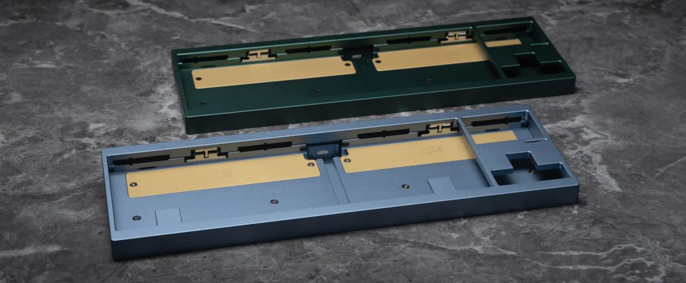
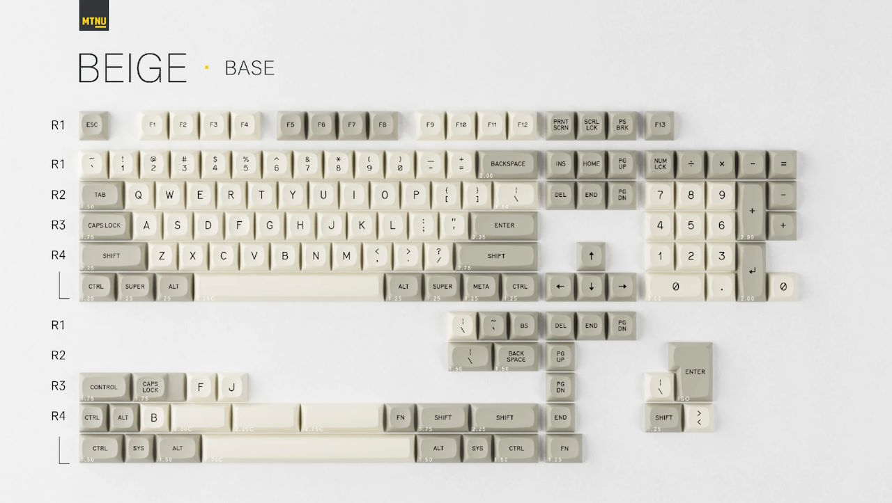
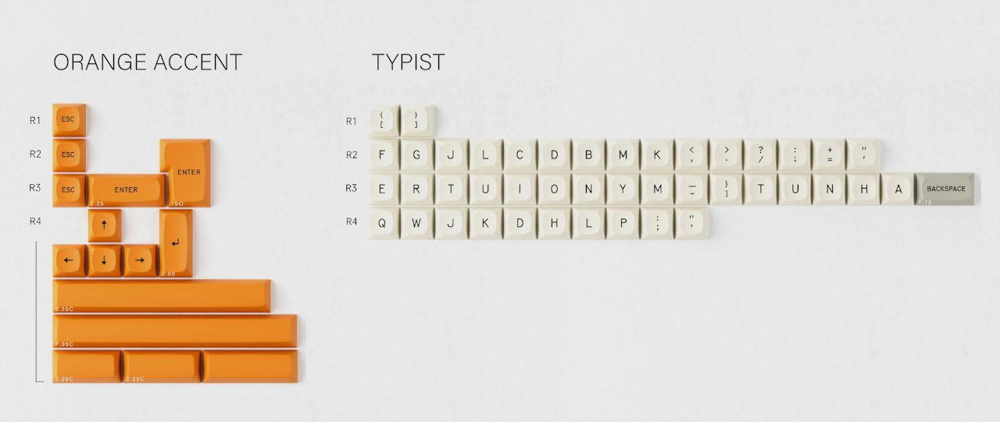
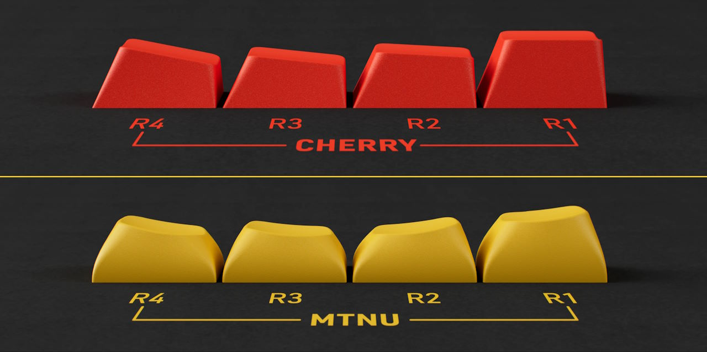
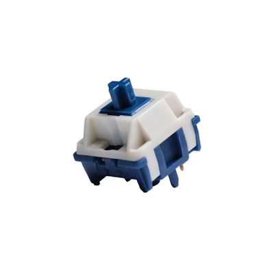
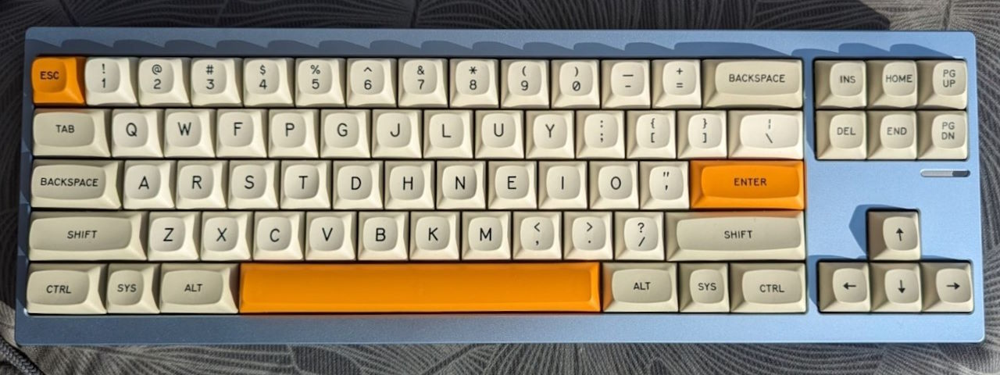
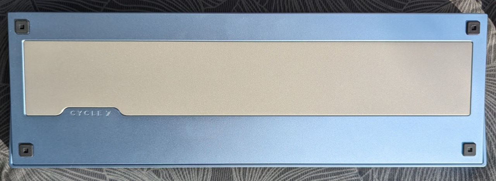

Behold the most hyped keyboard of 2023!

## TKD Cycle7



|  |  |
| ---- | ---- |
| Keyboard kit | TKD Cycle7 |
| Case | Anodized, CNC machined 6063-T6 aluminum ("Fog" blue)  |
| Layout | 70% / FRL TKL |
| Typing angle | 7° |
| Plate | Aluminum + PC |
| Mounting options | Gasket mount with two different types of gaskets |
| Lights | – |

> The aesthetics, the sound, the feel – they compete with boards in the $400 range.  
> [...] This is the best value board ever made.  
> — <cite>Blacksimon[^cycle7_blacksimon]</cite>

[^cycle7_blacksimon]: blacksimon on YouTube [You NEED To Try the Cycle7](https://www.youtube.com/watch?v=QOS4JzizGzs)

The TKD Cycle7[^cycle7_ic] is an "F-row-less" (FRL), "tenkeyless" (TKL) keyboard kit.
It uses a relatively simple, classic box-on-wedge design with a hefty stainless steel weight at the bottom reaching close to 2kg built.
A ball-catch mechanism enables quick and easy assembly and disassembly without tools. This feature helps the user experiment with the two mounting styles and decide whether to use the case foam or not.
The Cycle7 feels substantial and sounds great[^cycle7_markerchun] for a relatively low price starting at $139.

[^cycle7_ic]: ClickClack.io on geekhack.org [[IC] TKD Cycle7 (70%/FRL-TKL)](https://geekhack.org/index.php?topic=120373.0)
[^cycle7_markerchun]: markerchun [Cycle7](https://markerchun.com/cycle7)

After the rave reviews, I decided to order one.
I like the FRL layout. It looks a bit sleeker than a classic TKL and accessing the F keys by pressing the number keys and an additional function key is not much of a hassle if you rarely use the F keys.
This is my first board with an actual bottom weight that is meant to improve the sound.
I picked the light blue "Fog" color with the sandblasted stainless steel weight.

The Cycle7 was sold in a group buy[^cycle7_gb] between July 21 and August 22 2023 with an ETA of Q4 2023.
I ordered the keyboard with wired PCB and the sandblasted weight for 174 Euros plus an additional PC plate for 24 Euros.
TKD ran into some issues during the manufacturing leading to a small delay – I received it in February 2024.

[^cycle7_gb]: ClickClack.io on geekhack.org [[GB] Cycle7 by TKD](https://geekhack.org/index.php?topic=120913)

## GMK MTNU Beige




MTNU is a new-ish[^mtnu_launch][^mtnu_matt3o_released] keycap profile designed by matt3o and manufactured by GMK.
The keycaps are similar in size to the regular Cherry profile keycaps but the profile is "spherical" – the tops of the keycaps look as if they had been indented with a sphere.

[^mtnu_launch]: GMK_Andy on reddit.com [New GMK Profile 'MTNU" Launches Today](https://www.reddit.com/r/MechanicalKeyboards/comments/13yh27f/new_gmk_profile_mtnu_launches_today/)
[^mtnu_matt3o_released]: matt3o [MTNU out in the world!](https://matt3o.com/mtnu-out-in-the-world/)



I wanted to try some keycaps with a different profile and liked what I read about MTNU.[^mtnu_matt3o_pre-release]
They launched the profile with some classic colorways including beige and white-on-black.
The launch price was relatively low for GMK with 100 Euro base kits.
They[^mtnu_oblo] offered some "Typist" child kits, to convert the base kit to some alternative layouts including Dvorak and Colemak.
I use Colemak[^colemak] and jumped at the chance to have keycaps that – for once – match the layout I'm using.
The money I "saved" on the base kit, I spent on the child kits: 60 Euros for the Typist kit and 30 Euros for the orange accents.

[^mtnu_matt3o_pre-release]: matt3o [MTNU: Pre-release update](https://matt3o.com/mtnu-pre-release-update/)
[^colemak]: colemak.com [Colemak keyboard layout](https://colemak.com)
[^mtnu_oblo]: oblotzky.industries [GMK MTNU Beige](https://oblotzky.industries/products/gmk-mtnu-beige)

I pre-ordered the keycaps in June 2023 and received them in November 2023.

## HMX Xinhai



|  |  |
| ---- | ---- |
| Switch type | Linear |
| Top housing material | PA12 |
| Bottom housing material | Modified Nylon |
| Stem material | POM |
| Spring | 22mm KOS single stage extended |
| Operating force | 55gf |
| Bottom-out force | 62.5gf |
| Pre-travel distance | 2.0mm |
| Total travel distance | 3.4mm |

HMX switches and especially the Xinhais are some of the most hyped switches at the moment.
HMX produce switches with minimal wobble and great factory lubrication.

I bought the Xinhais for 45 Euros to see if there's something to the hype.
Turns out there is: they were excellent out of the box; some of the smoothest switches I've tried.

## The Build

I selected the MTNU Beige keycaps for the Cycle7 as a kind of constraint.
Visually, the beige keycaps and orange accents work great on the light blue keyboard.
I just needed to find a good build to also get good sound and feel.

I tried various switches with PC and aluminum plates and some different foam configurations.
In the end, I picked the aluminum plate with the Xinhais and PCB and case foams.

The case foam may not strictly be necessary.
Other Cycle7 customers noticed that their PCB touched the aluminum case with some force applied.
This might not be an issue with my relatively stiff configuration using the aluminum plate and the gasket strips.
But I played it safe and kept the case foam in.

Knowing that the Xinhais are high-pitched and loud, I used the PCB foam to mellow them out a bit.

I used the C3 Equalz stabilizers that came with the Cycle7.

## The Bill

```plain
TKD Cycle7 keyboard kit                       200 EUR
GMK MTNU Beige (Base, Accents, Typist)        190 EUR
HMX Xinhai                                     45 EUR
-------------------------------------------------------
                                              435 EUR
```

## The Result



<figure>
  <figcaption>Audio sample recorded with Sennheiser MKE 600 about 20cm above the keyboard pointing down:</figcaption>
  <audio controls src="/media/2024-08-23_keyboard_cycle7.mp3"></audio>
</figure>

Looks, feels, and sounds like a keyboard!

|  |  |
| ---- | ---- |
| Keyboard Kit   | TKD Cycle7 |
| Plate material | Aluminum |
| Mounting style | Gasket mount with gasket strips |
| Keycaps | GMK MTNU Beige |
| Switches | HMX Xinhai 62g |
| Stabilizers | C3 Equalz |
| Foam | PCB foam, case foam |
| Weight | 1.95kg |

Cycle7 good.  
MTNU good.  
HMX Xinhai good.

This might technically be my best keyboard.
It sounds and feels super solid and doesn't have any real flaws.

The combination of the light blue case with the beige keycaps and orange accents works.
The FRL layout avoids the alternating colors in the F-row that I hate.

The MTNU profile and Xinhais feels good on the board: it feels smooth.
The anodized case and the keycaps are smooth to the touch; the switches are about as smooth as they come.

In terms of the sound, the MTNU keycaps and foams tame the high pitch of the Xinhais pretty well.
The board is maybe a bit louder than I'd like but it sounds good.


