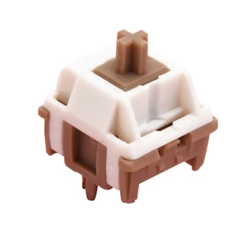

I gave into temptation (again) and bought one of my favorite keycap sets... and then a board to match.

## GMK Metropolis


I love GMK Metropolis[^metropolis_gb].  
I like the colors and how it uses more than one color for accents.
The set had been on my wish list for quite some time.

[^metropolis_gb]: nephlock on geekhack.org [[GB] GMK METROPOLIS R2](https://geekhack.org/index.php?topic=112071.0)


I especially like the Turnpike kit.
I'm a sucker for non-standard legends.
The regular insert, delete, ... cluster looks a bit crowded or uses abbreviations like "Pg"; and the caps lock legend does not make sense when you bind the key to another command (backspace).


The Signs novelties kit is almost too good to pass up on.
The keycaps look great with the bold colors and the symbols.
With the Turnpike kit alone, you'd lose the bold accents or you'd have to use the accents from the base kit – without the symbols.


Spacebars kits are pretty "wasteful".
You buy a bunch of spacebars only to the get the one you want – in the right size or color.
That said, the Metropolis accent colors look great...


Ooh, the alternate base kit just two colors looks amazing, too!
And it also has some of the nice symbols...

Once I saw a sale, I gave into temptation...  

I bought the Midnight base kit (119 Euros) together with the Turnpike kit (69 Euros).
That way, I could get either the look of the Midnight kit or use the Turnpike set to get the improved look of the regular base kit.
There was one additional benefit that would let me "justify" that purchase:
for GMK Stealth I bought a child kit with alternate alphas; so with a second overpriced child kit with alternate modifiers I could create a third set of keycaps.
I thought the gray alphas of the GMK Stealth base kit would work well with either the Midnight or Turnpike modifiers.

Then the next sale came and I added the Signs kit (32 Euros) and the Blocks kit (19 Euros) to my collection.
In total, I paid 239 Euros for Metropolis.
Not a smart investment, but at least it would give me a lot of options and together with Stealth it would fill more than one keyboard.

## qwertykeys Neo70


|  |  |
| ---- | ---- |
| Keyboard kit | Neo70 |
| Case | Anodized, CNC machined aluminum ("Navy" blue) |
| Layout | FRL TKL |
| Typing angle | 8° |
| Plate | Aluminum |
| Mounting options | Gasket mount or gummy o-ring mount |
| Lights | – |

The Neo70[^neo70][^neo70_markerchun] is a 70% / FRL TKL keyboard from qwertykeys' Neo series of entry-level custom keyboards.
It uses a simple unibody construction with a small "blocker" for the area above the arrow keys.
It uses two PCBs/plates to make that possible: a 60% PCB/plate on the left and another 10% PCB/plate on the right.
A hole in the bottom – usually covered by a magnetic badge – allows you to push out the assembly without any tools.
You don't even have to deal with any cables when you assemble or disassemble the board: the PCB connects to the components in the case with a magnetic connector.
This makes it really quick, easy, and comfortable to build or tune the board.

[^neo70]: qwertykeys [Neo70](https://qwertykeys.notion.site/Neo70-e8422f381f6e45cf8b620f55953c6737)
[^neo70_markerchun]: markerchun [Neo70](https://markerchun.com/neo70)

One of the things I like most about the Neo70: the navy blue case color.
I selected the Neo70 specifically for GMK Metropolis.
The navy matches the Metropolis base color pretty well.

For the weight, I chose the stainless steel "mirror dusk" weight.
It fits the dark theme of Metropolis and produces some blue and yellow tones.

## Build 1

### SWK Catmint


|  |  |
| ---- | ---- |
| Switch type | Linear |
| Top housing material | Nylon |
| Bottom housing material | Nylon |
| Stem material | POK |
| Spring | 20mm |
| Bottom-out force | 58gf |
| Pre-travel distance | 2.0mm |
| Total travel distance | 3.5mm |

> Catmints are a switch with a large, high-pitched bottom out and quiet top out sound.
> — <cite>Swagkeys[^catmint_swagkeys]</cite>

[^catmint_swagkeys]: swagkeys.com [SWK Catmint](https://swagkeys.com/products/swk-catmint)

The Catmint switches stood out to me in multiple video reviews of different keyboards.
So I bought some once a European shop carried them[^catmint_delta].

[^catmint_delta]: deltakeyco.com [SWK Catmint](https://deltakeyco.com/products/swk-catmint-switch)

### The Build

At first I experimented with a plateless build.
The SWK switches have relatively large pins. As a result, they sit tight in the PCB to the point that the plate becomes optional.
This worked well – but it sounded a bit more "plasticky" than what I wanted.
So I switched to the aluminum plate.

I did not use a lot of the fancy colored keycaps and instead kept the look pretty clean with only three accent pieces.
I'm hoping that I can use more of the remaining Metropolis keycaps in the future.

A unibody case like the Neo's can produce a pretty high volume and I was afraid that the high-pitched switches on aluminum might be a bit much, so I used the PCB and case foams.

### The Bill

```plain
Neo70 keyboard kit                            166 EUR
GMK Metropolis R2 (Base, Accents, Colevrak)   239 EUR
SWK Catmint                                    60 EUR
-------------------------------------------------------
                                              465 EUR
```

### The Result


<figure class="w-content">
  <figcaption>Audio sample recorded with Sennheiser MKE 600 about 20cm above the keyboard pointing down:</figcaption>
  <audio controls src="/media/2024-08-24_keyboard_neo70.mp3"></audio>
</figure>

Looks, feels, and sounds like a keyboard!

|  |  |
| ---- | ---- |
| Keyboard Kit   | Neo70 |
| Plate material | Aluminum |
| Mounting style | Gasket mount |
| Keycaps | GMK Metropolis |
| Switches | SWK Catmint |
| Stabilizers | NeoStabs |
| Foam | PCB foam, case foam |
| Weight | 1.54kg |

The keycaps match the navy case pretty well.
The board looks as I intended – fantastic.

For the Neo70, I was going for a clacky, high-pitched build with the aluminum plate and relatively high-pitched switches.
I'd say: mission accomplished!

The Catmint switches are pretty great.
They feel smooth and I like the medium weight between 50g and 60g.
On the board and the aluminum plate the bottom out feels a bit sharper than on most of my other boards – it's not my favorite.

As much as I like the high-pitched sound, for a daily driver I prefer something a bit more subtle like my Envoy.
A current weak point of the board is the spacebar. It may need some more tuning.
Eventually, I might try some different switches in the board and use the opportunity to improve the spacebar.


## Build 2 – 2025-02-04: Changed switches

My original conclusion hinted at the fact that my first build was not my favorite.
On the aluminum plate, the Catmints are a bit extreme.
Very high-pitched with a sharp bottom-out.

I wanted to try some of my other switches to see if I can turn one of my favorite boards in terms of looks into one of my overall favorite boards.

### HMX Macchiato



|  |  |
| ---- | ---- |
| Switch type | Linear |
| Top housing material | PA12 |
| Bottom housing material | Modified Nylon |
| Stem material | POK (Stem pole bottoming out) |
| Spring | 20mm single-stage extended spring |
| Operating Force | 42gf |
| Bottom-out Force | 50gf |
| Pre-travel distance | 2.0mm |
| Total travel distance | 3.8mm |

> Overall, these switches are smooth, clacky, and solid. 
> — <cite>unikeyboards.com[^macchiato_unikeys]</cite>

[^macchiato_unikeys]: unikeyboards.com [HMX Macchiato](https://unikeyboards.com/en-de/products/hmx-macchiato-linear-switch-10pcs)

I was really happy with the HMX Xinhais[^xinhai].
HMX produces some of the smoothest switches with the least amount of stem wobble. The Xinhais are some of the loudest and highest-pitched switches they made. I wanted to try another set of less extreme HMX switches.

[^xinhai]: [Keyboard 6: TKD Cycle7 + GMK MTNU Beige](/blog/2024-08-23_keyboard_6_cycle7/)

The Macchiatos are clacky but deeper than the Xinhais and Catmints.
They are not as loud as some other HMX switches like the Xinhais.

They feel great to me: smooth, almost full travel, and a 50g long spring.

I bought them second-hand in a pack of 90 for 25 Euros.

### The Updated Build

Some of the Neo Stabs had some imperfections.
Instead of trying to tune them, I put in some Cherry + C3 stabilizers.

### The Updated Bill

The HMX Macchiato switches were a bargain.

```plain
Neo70 keyboard kit                            166 EUR
GMK Metropolis R2 (Base, Accents, Colevrak)   239 EUR
HMX Macchiato                                  25 EUR
Cherry + C3                                    10 EUR
-------------------------------------------------------
                                              440 EUR
```

### The Updated Result


<figure class="w-content">
  <figcaption>Audio sample recorded with Sennheiser MKE 600 about 20cm above the keyboard pointing down:</figcaption>
  <audio controls src="/media/2025-02-04_neo70_macchiato.mp3"></audio>
</figure>

The HMX Macchiatos are a great fit for this board.
They sound flawless and I find them pleasant to type on and listen to.

|  |  |
| ---- | ---- |
| Keyboard Kit   | Neo70 |
| Plate material | Aluminum |
| Mounting style | Gasket mount |
| Keycaps | GMK Metropolis |
| Switches | HMX Macchiato |
| Stabilizers | NeoStabs |
| Foam | PCB foam, case foam |
| Weight | 1.54kg |
