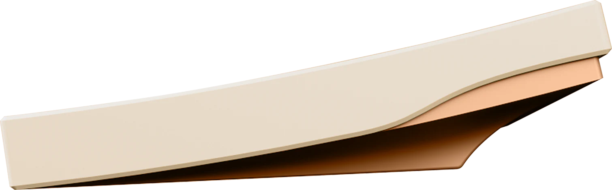
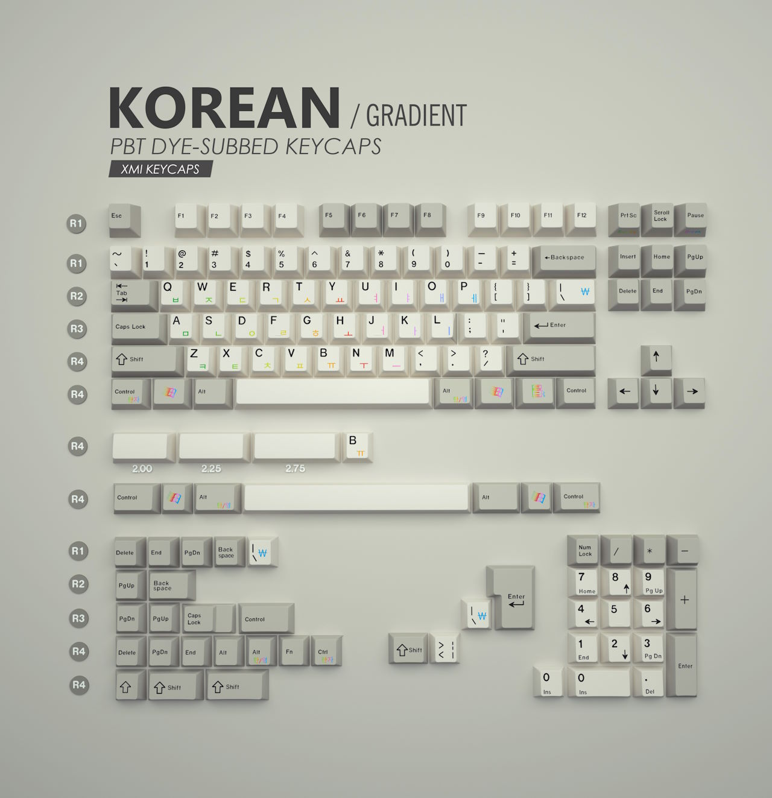
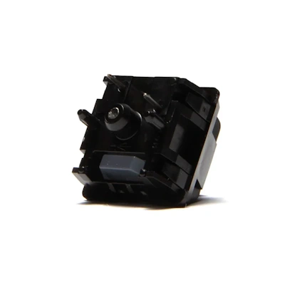

A cream-colored board with a hefty copper weight is exactly what I was "missing"...

## The Inspiration: Werk One Moloko



The werk.technica Werk One is one of the most "endgame"-worthy keyboards I've seen over the last couple of years.
I appreciate the style: "Werk One is our tribute to the sophistication of art deco and 70’s futurism." [^werk_one]

[^werk_one]: werktechnica.com [Werk One Moloko](https://werktechnica.com/products/moloko)

My favorite Werk One colorway, called Moloko, features a creme white top case on a fully copper bottom case: "We consider Moloko our signature colourway bridging the gap between nostalgic 80's computational hardware design colour and the futurist design language of the Werk One." [^werk_one]

One thing i dislike about the Werk One is its price tag:
the Moloko version was sold for 1450 Euros without keycaps or switches.
Even if I had descended far enough into the madness to buy a 1.6k Euros keyboard, I still would have skipped the Werk One – I'm not a fan of the layout.

I didn't get a Werk One, but I was open to a more budget "Moloko at home".

## Krush65


|  |  |
| ---- | ---- |
| Keyboard kit | Krush65 |
| Case | E-coated CNC machined aluminum "Cream" with copper weight |
| Layout | 65% |
| Typing angle | 7° |
| Plate | PP |
| Mounting options | Top mount or gummy o-ring mount |
| Lights | RGB underglow visible on the inner edges of case |

The Krush65[^krush65_ic][^krush65_nuxros][^krush65_alexotos] is a 65% keyboard in the premium budget segment.
The design forgoes current trends like foams or screwless assembly.
Instead, the board focuses on classic virtues of custom keyboards.
You get a large copper weight and a great top mount design for a good price.
The board reaches 1.7kg unbuilt; it feels super solid.

[^krush65_ic]: nuxroskb on geekhack.org [[IC] Krush65](https://geekhack.org/index.php?topic=120988.0)
[^krush65_nuxros]: nuxroskb.store [Krush65 Keyboard Kit](https://nuxroskb.store/products/krush65)
[^krush65_alexotos]: alexotos on YouTube [A mechanical keyboard starting at $135? They Krush'ed it with this one.](https://www.youtube.com/watch?v=es5d8xXJ7fE)

Initially, the interest check (IC)[^krush65_ic] for a group buy (GB) did not include the cream color.
So I suggested it in the Nuxros discord[^krush65_discord_suggestions] pointing out how great the combination looks on the Werk One.
Once they added Cream – potentially based on my request – I had to buy one.

[^krush65_discord_suggestions]: me on Discord [Suggestion of cream colorway](https://discord.com/channels/881866319866257408/1008757140187517018/1137725797952655442)

The Krush65 was sold in a group buy in May 2024 for around 170 Euros.
You could choose between twelve colors and eight weight options with an aluminum plate by default and four additional materials offered for extra plates.
The manufacturer Kezewa delivered the boards as planned in December 2024.

I purchased the Krush65 from Keygem for 170 Euros with an additional PP plate for 25 Euros and 6 Euros for shipping.

## XMI Vintage Beige



XMI keycaps use the popular Cherry profile made with 1.6mm thick PBT plastic with durable dyesub legends.
Since dye sublimation works best on light-colored plastic, XMI offers only white, beige, and vintage beige as base colors.

XMI make up for the limited selection of base colors through an enormous amount of customization for the legends.
In an XMI group buy, you can pick your legends from different colors, fonts, and with a variety of possible sublegends.
Possible configurations include Comic Sans legends in rainbow gradient colors, or side-printed Korean legends.

I bought the base kit (43 Euros) and a Colevrak kit (16 Euros) for Colemak support for around 68 Euros including shipping total.

After I paid ~60 Euros for a Colevrak kit for my MTNU Beige keycaps, a complete set of base kit and Colevrak kit for 70 Euros in total was a no-brainer. Since I already had some classic beige keycaps, I went with Vintage Beige. I didn't have any particular keyboard or color combination in mind when I bought the keycaps – beige works on most case colors.

## SW x Haimu MP Tactile



|  |  |
| ---- | ---- |
| Switch type | Tactile |
| Top housing material | POM |
| Bottom housing material | POM with Metal Bottom Hole Housing |
| Stem material | UPE Stem with Metal Pole Tip |
| Spring | 18mm |
| Bottom-out force | 62gf |
| Pre-travel distance | 2.0mm |
| Total travel distance | 3.6mm |

The SW x Haimu MP Tactile[^mptactile_delta] switches feature metal inserts at the bottom of the stem. This produces a sharper, higher-pitched sound compared to the impact of plastic on plastic.

[^mptactile_delta]: deltakeyco.com [SWK Catmint](https://deltakeyco.com/products/swk-x-haimu-mp-tactile-switches)

I was curious about the metal poles.
Videos seemed promising.
I wanted to try the concept to add some more variety to my collection of keyboards.
When I was shopping for switches with metal inserts, another member of a keyboard-focused Discord community decided to gift me his MP Tactiles – I only had to cover the shipping (11 Euros). He had won the switches in a giveaway but didn't intend to use them, so he decided to pay it forward.

## The Build

When building the Krush65, I experimented with ten types of switches.
As finalists I picked the new Nixies, the MP Tactiles, and the Keygeek&nbsp;Y3s.

I first built the board with the new Nixies.
I liked the sound, but I once again realized that the springs I used (50g, 15mm) are too light for me.
It's not a great match for the heavy board and I make more typos.
At some point, I might try a second spring swap and use longer springs with a force between 55g and 60g.

Then I chose the MP Tactiles.
They feel more substantial and the sound works well for the board.
I like their tactility.

For the keycaps, I tried both the XMI Vintage Beige keycaps and my PBTFans Black on White keycaps.
I was a bit conflicted.
The black-on-white keycaps look clean and modern with no asymmetry from the 65% layout.
The vintage beige keycaps lead to a more classic look.  
For now I'll use the XMI keycaps.

## The Bill

```plain
Krush65 keyboard kit                            201 EUR
XMI Vintage Beige (Base, Colevrak)               68 EUR
SW x Haimu MP Tactile                            11 EUR
SW Knight Stabilizers v1                         20 EUR
-------------------------------------------------------
                                                300 EUR
```

## The Result


  
<figure>
  <figcaption>Audio sample recorded with Sennheiser MKE 600 about 20cm above the keyboard pointing down:</figcaption>
  <audio controls src="/media/2024-12-22_keyboard_krush65.mp3"></audio>
</figure>

Looks, feels, and sounds like a keyboard!

|  |  |
| ---- | ---- |
| Keyboard Kit   | Krush65 |
| Plate material | PP |
| Mounting style | Top mount |
| Keycaps | XMI Vintage Beige |
| Switches | SW x Haimu MP Tactiles |
| Stabilizers | SW Knight Stabilizers v1 |
| Foam | - |
| Weight | 2.13kg |

The keyboard combines a classic look with some modern accents.
From the top it looks "vintage" but the copper weight and subtle RGB lighting tells a different story.

The board feels great all around.
The case shines with its smooth e-coating, the heavy copper weight, and copper–cream side profile.
The MP Tactiles are as good as I had hoped; they feel and sound great and complement the keyboard.


