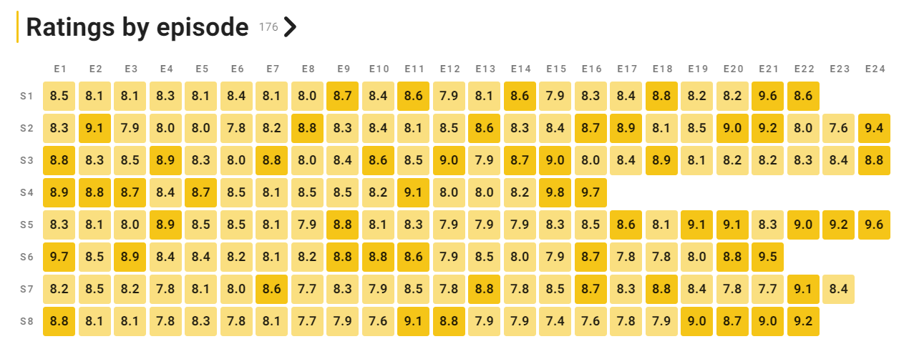

## Tracking What Media I Consume

In 2020, I started tracking all shows/movies/books/games I consume in a simple text file.

I rate everything using a rough 5-star scale.
For the scale, I value "entertainment" and how well it captures my attention over "quality".
For example, if a movie is entertaining enough that I fully focus on the movie without browsing the web on a second screen, I might rate it 5 stars even when the movie is not perfect.
As a result, I consciously "overrate" some media but I use more of the scale.
The scale is rough in that it uses just five stars, I have not fully defined what each rating means.
This focus on my attention might not be entirely fair to all movies: I'll underrate some and overrate others.

Rough idea:

```plain
Games 2024
★★★★★ Gets me hooked; I play it frequently; also during the week; I choose it over TV
★★★★ Good to great game that does not get me hooked; might not value my time enough
★★★
★★
★
  1 ... ★★★★★
  2 ... ★★★★
  ...

Books – Fiction 2024
★★★★★ Unputdownable
★★★★
★★★
★★
★
  1 ... ★★★★★
  2 ... ★★★★
  ...

Books – Non-fiction 2024
★★★★★ Immediately helps me improve at my job
★★★★ Leaves me with new skills/insights; does not drag
★★★
★★
★
  1 ... ★★★★★
  2 ... ★★★★
  ...

Movies 2024
★★★★★ Engrossing
★★★★ Good to great movie
★★★ Doesn't fully capture my attention; doing something else on the second screen
★★
★
  1 ... ★★★★★
  2 ... ★★★★
  ...

TV 2024
★★★★★ Would binge in a few sittings; have to watch the next episode before any other shows
★★★★ Good to great show
★★★ Doesn't fully capture my attention; doing something else on the second screen
★★
★
  1 ... ★★★★★
  2 ... ★★★★
  ...
```

Note: not everything I consumed in 2024 was released in 2024.
I will include older content in my best-of lists when I consumed it in 2024.

## Best Games 2024

I played six games this year; mostly single player games.
I finally returned to Cyberpunk 2077 (v2.1) put around 80 hours into it.
I directly jumped into Phantom Liberty and got hooked enough to finish the main story and lots of side quests.

1. Cyberpunk 2077: Phantom Liberty ★★★★★ – Great setting, story and meaningful player choices
2. Cyberpunk 2077 ★★★★★ – There is so much to do in the game and even the side quests are great.
3. Call of Duty: Black Ops 6 Multiplayer ★★★★★ – Great multiplayer game
4. Residen Evil 4 (Remake) ★★★★+ – Impressive remake almost 20 years after I played the original on the Gamecube
5. Hogwarts Legacy ★★★★+ – They did a great job re-creating Hogwarts
6. Hellblade 2 ★★★★ – The visuals and atmosphere are incredible at time
7. Call of Duty: Black Ops 6 Campaign ★★★★ – My first CoD campaign since the 2007 Modern Warfare; surprisingly varied with some good missions

## Best Books 2024 – Fiction

I completed four fiction books this year.
I mainly read books 4–6 of the Red Rising series; now I'm eagerly awaiting the final entry in the series.

1. Light Bringer ★★★★★ – Epic; the book has a 4.75 on goodreads and it deserves it
2. Dark Age ★★★★★ – As bleak and dark as it gets; imagine an extended "red wedding"
3. Iron Gold ★★★★+ – Fantastic setup for the remainder of the series
4. The Poppy War ★★★★ – Nice setting

I enjoyed the first three books in the series a lot and thought the third book, Morning Star, was a great conclusion of the trilogy. 
I had no immediate intention of reading the rest of the series but this year I picked it up again.

Iron Gold was great, but when I started Dark Age and Light Bringer I could barely stop myself.
I read most of Dark Age (~800 pages) and Light Bringer (~700 pages) in my three week summer vacation
(instead of reading some non-fiction books I had planned to start).

I am ready to proclaim Red God, the seventh and final book in the Red Rising saga, my book of the year 2025 (assuming it doesn't get delayed).

## Best Books 2024 – Non-fiction

I read a grand total of one non-fiction books this year.
I blame the Red Rising books.

1. Relevant Search ★★★★★ – Great introduction to search

## Best Movies 2024

I watched 55 movies this year; only four of them "at the movies".

My top 5 movies in the order that I watched them:

- Guardians of the Galaxy 3 ★★★★★ – Still great on my second watch (after I watched it in German at the movies last year)
- All of Us Strangers ★★★★+ – Weird in a good way; I might have to watch this again
- Dune: Part Two (at the movies) ★★★★★ – Great movie theater experience
- Spider-Man: No Way Home (extended) ★★★★+ – Still good on my second watch (first time in English; first time extended)
- Deadpool & Wolverine (at the movies, 3D) ★★★★★ – Good movie theater experience; I had a great time even if the movie is not quite "great"

## Best Shows 2024

2024 was my year of the rewatch.
I don't rewatch a lot of shows – there's always so much new stuff I want to see.
But 20 years after House premiered I decided to rewatch all 8 seasons, 176 episodes, 129h 48m of the show. And then I watched the mini series Generation Kill for the third time.
I'll exclude the shows from my 2024 list.

Best shows this year – roughly ordered without overthinking it:

1. Shogun S1 ★★★★★+ – Great setting, production, cast, ...
2. Shrinking S2 ★★★★★ – Good mix of funny and emotional with a delightful cast of characters
3. The Bear S3 ★★★★★ – Still good with some really high highs
4. Fallout S1 ★★★★★ – Turns out you can make a great video game adaptation
5. House of the Dragon S2 ★★★★★ – Who was that again? Woah, dragons!
6. The Boys S4 ★★★★★ – Bold, unhinged, always entertaining
7. The Diplomat S2 ★★★★★ – Consistently high quality
8. Nobody Wants This ★★★★★ – Easy-to-binge rom-com
9. Only Murders in the Building S4 ★★★★★ – Still delightful
10. English Teacher ★★★★★ – Funniest new comedy this year

Honorable mentions:

- Agatha All Along ★★★★★
- Ted S1 ★★★★★
- Halo S2 ★★★★★
- Industry S3 ★★★★+
- Tokyo Vice S2 ★★★★+
- For All Mankind S4 ★★★★+
- Supacell S1 ★★★★+
- The Good Doctor S7 ★★★★+
- A Man on the Inside S1 ★★★★+
- Black Doves ★★★★+

Best episodes of the year:

1. The Bear S3 E6 – Napkins (9.1/10 on [imdb](https://www.imdb.com/title/tt14452776/episodes/?season=3) with 8k ratings)
2. Shrinking S2 E12 – The Last Thanksgiving (9.3/10 on [imdb](https://www.imdb.com/title/tt15677150/episodes/?season=2) with 1.1k ratings)
3. Superman & Lois S4 E10 – It Went by So Fast (9.5/10 on [imdb](https://www.imdb.com/title/tt11192306/episodes/?season=4) with 1.7k ratings)
4. Agatha All Along E7 – Death's Hand in Mine (9.1/10 on [imdb](https://www.imdb.com/title/tt15571732/episodes/?season=2) with 15k ratings)
5. House of the Dragon S2 E4 – The Red Dragon and the Gold (9.4/10 on [imdb](https://www.imdb.com/title/tt11198330/episodes/?season=2) with 58k ratings)
6. House of the Dragon S2 E7 – The Red Sowing (8.8/10 on [imdb](https://www.imdb.com/title/tt11198330/episodes/?season=2) with 37k ratings)
7. The Acolyte E5 – Night (6.5/10 on [imdb](https://www.imdb.com/title/tt12262202/episodes/) with 18k ratings)

I'm probably missing some really great episodes; I should probably track them better.

Best shows I rewatched this year:

- Generation Kill (3rd time) ★★★★★+
- House S1 ★★★★★
- House S2 ★★★★★
- House S3 ★★★★★
- House S4 ★★★★★+
- House S5 ★★★★★
- House S6 ★★★★★
- House S7 ★★★★★
- House S8 ★★★★★

The character House is consistently fun to watch.
Initially I wondered whether I should watch only the good episodes again.
Turns out they are all pretty good[^imdb_house]:



[^imdb_house]: imdb.com [House](https://www.imdb.com/title/tt0412142/)

## The Raw Data

It's best you stop reading here (or don't judge me).

```plain
Games 2024
★★★★★ Gets me hooked; I play it frequently; also during the week; I choose it over TV
★★★★ Good to great game that does not get me hooked; might not value my time enough
★★★
★★
★
	1 Hogwarts Legacy ★★★★+
	2 Residen Evil 4 (Remake) ★★★★+
	3 Cyberpunk 2077: Phantom Liberty ★★★★★
	4 Cyberpunk 2077 ★★★★★
	5 Call of Duty: Black Ops 6 Campaign ★★★★
	6 Hellblade 2 ★★★★
	7 Call of Duty: Black Ops 6 Multiplayer ★★★★★

Books – Fiction 2024
★★★★★ Unputdownable
★★★★
★★★
★★
★
	1 Iron Gold ★★★★+
	2 Dark Age ★★★★★
	3 Light Bringer ★★★★★
	4 The Poppy War ★★★★

Books – Non-fiction 2024
★★★★★ Immediately helps me improve at my job
★★★★ Leaves me with new, skills/insights; does not drag
★★★
★★
★
	1 Relevant Search ★★★★★

Movies 2024
★★★★★ Engrossing
★★★★ Good to great movie
★★★ Doesn't fully capture my attention; doing something else on the second screen
★★
★
	1 Past Lives ★★★
	2 Asteroid City ★★★-
	3 Guardians of the Galaxy 3 (en) ★★★★★
	4 Killers of the Flower Moon ★★★-
	5 As Good as It Gets ★★★★
	6 Barbie ★★★+
	7 All of Us Strangers ★★★★+
	8 The Marvels ★★★★
	9 Saltburn ★★★★
	10 Society of the Snow ★★★
	11 Old Henry ★★★★
	12 Anyone But You ★★★★
	13 The Killer – Someone Deserves to Die ★★★★-
	14 Damsel ★★★★
	15 Dune 2 (en, Kino) ★★★★★
	16 Roter Himmel ★★★
	17 Madame Web ★★★
	18 Spider-Man: No Way Home (en, extended) ★★★★+
	19 Road House ★★★★+
	20 The Beekeeper ★★★★
	21 Next Goal Wins ★★★-
	22 Land of Bad ★★★★
	23 The Idea of You ★★★★+
	24 50/50 ★★★
	25 Blade ★★★★
	26 Anatomie eines Falls ★★★
	27 Furiosa ★★★★ (Kino)
	28 Godzilla Minus One ★★★
	29 The Hill ★★★+
	30 Beverly Hills Cop: Axel F ★★★+
	31 The Ministry of Ungentlemanly Warfare ★★★★
	32 Set it up ★★★★
	33 Deadpool & Wolverine (Kino, 3D) ★★★★★
	34 The Sound of Freedom ★★+
	35 Twisters (2024) ★★★★
	36 The Union (2024) ★★★★
	37 Kingdom of the Planet of the Apes ★★★★
	38 Rebel Ridge ★★★★-
	39 Dream Scenario ★★★★
	40 Falling Into Place ★★★★
	41 Challengers ★★★★-
	42 Wolfs ★★★★+
	43 Alien: Romulus ★★★★+
	44 Venom: The Last Dance (Kino, en) ★★★
	45 Lonely Planet ★★★★
	46 The Substance ★★★★
	47 Late Night with the Devil ★★★★-
	49 Carry-on ★★★★+
	50 Bad Boys: Ride or Die ★★★★
	51 Hit Man ★★★★
	52 Wicked Little Letters ★★★
	53 Red One ★★★★
	54 Civil War ★★★★+
	55 Boiling Point ★★★★

TV 2024
★★★★★ Would binge in a few sittings; have to watch the next episode before any other shows
★★★★ Good to great show
★★★ Doesn't fully capture my attention; doing something else on the second screen
★★
★
	1 Culprits S1 ★★★★
	2 The Guardians of the Galaxy Holiday Special ★★★
	3 The Americans S1 ★★★★
	4 The Americans S2 ★★★★
	5 Echo S1 ★★★
	6 Monarch: Legacy of Monsters S1 ★★★★
	7 For All Mankind S4 ★★★★+
	8 The Americans S3 ★★★★
	9 Reacher S2 ★★★★
	10 The Americans S4 ★★★★
	11 Transplant S4 ★★★★
	12 Percy Jackson and the Olympians S1 ★★★★+
	13 The Americans S5 ★★★★
	14 The Americans S6 ★★★★+
	15 The Brothers Sun S1 ★★★★
	16 House of Ninja S1 ★★★
	17 True Detective: Night Country ★★★★
	18 Criminal Record S1 ★★★★
	19 One Day ★★★★
	20 Sanctuary: A Witch's Tale ★★★★
	21 Ted S1 ★★★★★
	22 Masters of the Air ★★★★
	23 The Gentlemen S1 ★★★★+
	24 Halo S2 ★★★★★
	25 3 Body Problem S1 ★★★★
	26 Constellation S1 ★★★★
	27 Renegade Nell S1 ★★★★
	28 Fallout S1 ★★★★★
	29 Extraordinary S2 ★★★★
	30 Tokyo Vice S2 ★★★★+
	31 Invincible S2 ★★★★
	32 Shogun ★★★★★+
	33 Dead Boy Detectives S1 ★★★★+
	34 Ghosts S3 ★★★★
	35 Shardlake S1 ★★★★
	36 The Clone Wars S4 (the good parts; 16 Folgen) ★★★
	37 X-Men 97 S1 ★★★
	38 Animal Control S2 ★★★
	39 Sugar S1 ★★★★
	40 Bodkin S1 ★★★★
	41 The Tracker S1 ★★★+
	42 Elsbeth S1 ★★★-
	43 Generation Kill (3rd time) ★★★★★+
	44 Chicago Fire S12 ★★★★
	45 House S1 ★★★★★
	46 Grey's Anatomy S20 ★★★★
	47 House S2 ★★★★★
	48 Sullivan's Crossing S2 ★★★+
	49 House S3 ★★★★★
	50 House S4 ★★★★★+
	51 House S5 ★★★★★
	52 Supacell S1 ★★★★+
	53 Under the Bridge ★★★ 
	54 All American S6 ★★★+
	55 The Acolyte ★★★★+
	56 The Boys S4 ★★★★★
	57 Dark Matter ★★★★
	58 Presumed Innocent ★★★★+
	59 Those About to Die ★★★★
	60 House of the Dragon S2 ★★★★★
	61 House S6 ★★★★★
	62 House S7 ★★★★★
	63 House S8 ★★★★★
	64 The Bear S3 ★★★★★
	65 My Lady Jane S1 ★★★★
	66 The Walking Dead: The Ones Who Live ★★★
	67 Batman: Caped Crusader S1 ★★★
	68 Foundation S2 ★★★+
	69 Evil S4 ★★★+
	70 Acapulco S3 ★★★★
	71 The Good Doctor S7 ★★★★+
	72 Interview with the Vampire S2 ★★★★
	73 Terminator Zero ★★★+
	74 The Perfect Couple ★★★★
	75 Nobody Wants This ★★★★★
	76 Industry S3 ★★★★+
	77 Lord of the Rings: The Rings of Power S2 ★★★★
	78 Seal Team S7 ★★★★
	79 Slow Horses S4 ★★★★
	80 Bad Monkey S1 ★★★★
	81 English Teacher S1 ★★★★★
	82 Lincoln Lawyer S3 ★★★★
	83 Only Murders in the Building S4 ★★★★★
	84 Agatha All Along ★★★★★
	85 The Diplomat S2 ★★★★★
	86 The Penguin S1 ★★★★
	87 Cross S1 ★★★★-
	88 Paris Has Fallen ★★★★-
	89 Superman & Lois S4 ★★★★
	90 The Old Man S2 ★★★★
	91 Special Ops: Lioness S2 ★★★★
	92 The Day of the Jackal S1 ★★★★
	93 Sweatpea S1 ★★★★
	94 Shrinking S2 ★★★★★+
	95 Like Water for Chocolate S1 ★★★
	96 Black Doves S1 ★★★★+
	97 A Man on the Inside S1 ★★★★+
	98 Based on a True Story S2 ★★★★
	99 Colin from Accounts S1 ★★★★+
	100 Say Nothing ★★★★
	101 Interior Chinatown ★★★★+
```
