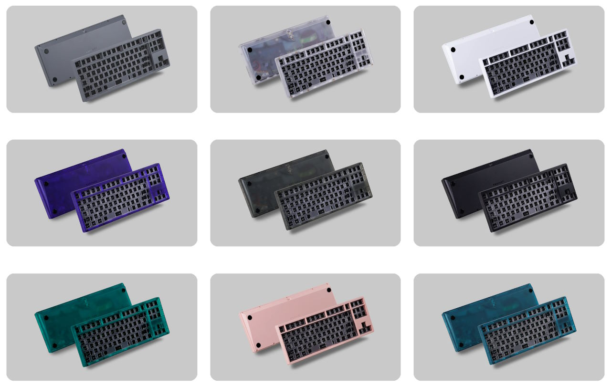
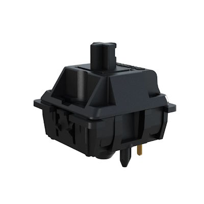

So I bought the same keyboard twice... but it was really cheap the second time.
And I already had the keycaps.

## KBDfans Tiger 80 Lite

|  |  |
| ---- | ---- |
| Keyboard kit | KBDfans Tiger 80 Lite |
| Case | ABS plastic, translucent (purple) |
| Layout | F13 TKL |
| Typing angle | 7° |
| Plate | PC |
| Mounting options | Gasket mount |
| Lights | RGB underglow |



I first bought the Tiger 80 Lite as my second serious keyboard in a pretty good deal for the time[^keyboard2]. I paid around 120 Euros including a second case. I got both the translucent purple case and a plain white case (in case I didn't like the purple).

[^keyboard2]: [Keyboard 2: Tiger80 Lite](/blog/2024-08-19_keyboard_2_tiger80lite/)

It's still a good keyboard with my favorite layout.
It was a pity I could never use the white case in addition to the purple case.

I recently stumbled on a good second-hand offer:
a Tiger80 Lite including all accessories and a second case for 70 Euros including shipping.
That's a really good price for the keyboard – even in 2025!
The keyboard comes with a great carrying case and complements the one I already had. The two colors: plain black and translucent black.

## Build 1

### PBTfans Black on White (BoW)

The Tiger80 Lite is a good fit for lower-pitched, "thocky" builds. PBT keycaps fit the deeper sound profile.

I decided to buy the second Tiger80 Lite to use with the PBTfans BoW that I already had and that I used in the first build of my first Tiger80 Lite.

### Gateron Oil King



|  |  |
| ---- | ---- |
| Switch type | Linear |
| Top housing material | Nylon PA6 |
| Bottom housing material | Proprietary "INK" blend |
| Stem material | POM |
| Spring | 20mm long springs |
| Operating Force | 55gf |
| Bottom-out Force | 80gf |
| Pre-travel distance | 2.0mm |
| Total travel distance | 4.0mm |

The Oil Kings[^oilking_product] are a community favorite.
They were released in 2022 and are still among the most purchased switches at the end of 2024[^oilking_sales]. They are smooth and produce a deep, muted bottom-out sound[^oilking_review].

[^oilking_product]: Gateron [Gateron Oil King](https://www.gateron.co/products/gateron-oil-king-switch-set)
[^oilking_review]: theremingoat [Gateron Oil King Switch Review](https://www.theremingoat.com/blog/gateron-oil-king-switch-review)
[^oilking_sales]: kbd.news [Best-selling keyboard switches of December, 2024](https://kbd.news/Best-selling-keyboard-switches-of-December-2024-2562.html)

I bought the Gateron Oil Kings in 2022; 60 Euros for a pack of 90.
I initially used them in my Keychron Q65. They sounded and felt great in the board but they blocked the RGB.
At some point I manually lubed them to improve on the factory lube.
I tested them with most of my boards but always chose other switches in the end.

### The Build

I combined the black-on-white keycaps with the white case for a plain white board.
I could probably mix and match the Tiger80 cases with a white top case and the translucent black bottom case but I started with the plain white variation.

I used the second Tiger80 Lite for experimentation.
I build one of them with PE foam and one without.
Then I compared switches across the two boards with GMK ABS and PBTFans PBT keycaps.

I wanted to build one of the two boards with the silent linear switches.
I had the impression that the silent switches sounded slightly better with the GMK keycaps, so I chose my first Tiger80 Lite for the silent build.

The board sounded good with multiple switches including the Oil Kings and the Keygeek Y3s. They worked well with and without PE foam.
I went with the Oil Kings on PE foam but it could have gone either way.
I figured it's a good opportunity to finally use the Oil Kings again and that one of my boards should use a PE foam configuration.
It's possible that I might prefer the board with the Y3s on PE foam with their lighter springs and even smoother feel but for now I'm happy with the Oil Kings.

I tried a couple of different switches for the spacebar including Nixies, MP Tactiles, and Princess Tactiles. I picked the Princess Tactiles.

I used Cherry C3 stabilizers.

### The Bill

```plain
Tiger 80 Lite keyboard kit                       70 EUR
PBTfans BoW                                      90 EUR
Gateron Oil King switches                        60 EUR
Cherry C3 stabilizers                            10 EUR
-------------------------------------------------------
                                                230 EUR
```

### The Result


<figure class="w-content">
  <figcaption>Audio sample recorded with Sennheiser MKE 600 about 20cm above the keyboard pointing down:</figcaption>
  <audio controls src="/media/2025-01-10_keyboard_tiger80_oiking_pe.mp3"></audio>
</figure>

Looks, feels, and sounds like a keyboard!

|  |  |
| ---- | ---- |
| Keyboard Kit | Tiger 80 Lite |
| Plate material | PC |
| Mounting style | Gasket |
| Keycaps | PBTFans BoW |
| Switches | Gateron Oil King, Princess Tactile spacebar |
| Stabilizers | Cherry C3 |
| Foam | PE foam, plate foam |
| Mods | – |
| Weight | 0.65kg |

Turned out pretty good.
